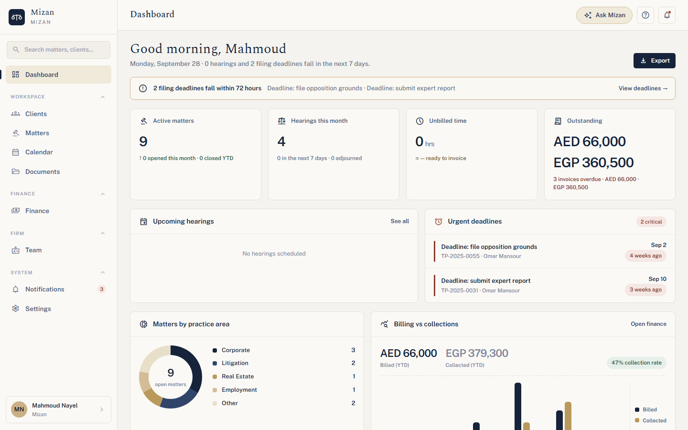
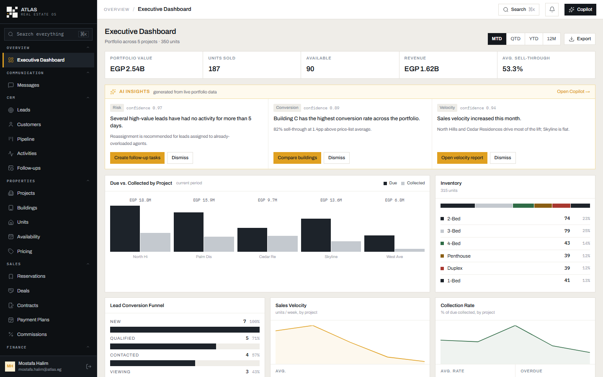

# Project-404 — one foundation, three real products

    

Project-404 is a **domain-agnostic application foundation** — identity, permissions, multi-tenancy, files,
audit, notifications, events, AI orchestration — and **three independently deployed products** built on it:
a law-firm system, a real-estate developer OS and a hotel operations platform.

The foundation (`core/`) supplies the engine and knows nothing about any business. Each product supplies its
own domain, its own database and its own apps, and reaches Core only through published contracts. None of
the three re-implements auth, tenancy, permissions, file storage, an audit trail or an outbox.

> 📘 **Want the full picture?** Read the [engineering overview](docs/engineering-overview.md): the whole
> system in one document. The governing rules are in [Plan.md](Plan.md).


---

## Contents

- [The products](#the-products)
- [What each product does](#what-each-product-does)
- [One request, end to end](#one-request-end-to-end)
- [Screenshots](#screenshots)
- [Architecture](#architecture)
- [Core capabilities](#core-capabilities)
- [Getting started](#getting-started)
- [Demo accounts](#demo-accounts)
- [Running the tests](#running-the-tests)
- [Security model](#security-model)
- [AI assistance](#ai-assistance)
- [Project layout](#project-layout)
- [Known limitations](#known-limitations)
- [Documentation](#documentation)

---

## The products

| | Product | Domain | Apps | Status |
|---|---|---|---|---|
| **`core/`** | **Project-404 Core** | None — the reusable platform | — | 13 capabilities · v0.1 shipped |
| **`mizan/`** | **Mizan** — Project #1 | Law-firm management | web · mobile (Expo) | backend domain complete · web F0–F16 · 18 mobile screens · **202 tests** |
| **`atlas/`** | **Atlas** — Project #2 | Real-estate developer OS | web | backend + web complete · **80 backend / 5 web tests** |
| **`hotel-project/`** | **HotelOS** — Project #3 | Hotel operations for **Hotel Transylvania** | staff app · public website | 8 slices complete · **139 backend / 58 app tests · 54 E2E runs** |

Each product is its own deployable: its own process, its own PostgreSQL database, its own seed. They share
`core/` by **source import** — never by a running process or a shared schema. Mizan was the first product and
proved Core's contracts; Atlas was built to find out which parts were really reusable and which were
Mizan-shaped; HotelOS is the third, and the one the **Rule of Three** was waiting for.

## What each product does

### Mizan — law-firm management

| Role | What they do |
|---|---|
| **Firm admin / Partner** | Run the firm: users and roles, settings, audit log, dashboards, billing oversight |
| **Lawyer** | Clients and matters, hearings, tasks, documents, time and disbursements |
| **Paralegal** | Case work support: documents, calendar, tasks |
| **Finance** | Invoices, payments, expenses, collections, per-currency billing (no FX) |

Bilingual: English by default, Arabic one switch away with full RTL. A native mobile client (Expo) covers the
same API: today view, cases, calendar, files with offline pinning, clients, finance and quick capture.

### Atlas — real-estate developer OS

| Area | What it covers |
|---|---|
| **CRM** | Leads, customers, pipeline, activities, follow-ups |
| **Inventory** | Projects, buildings, units, availability, price lists |
| **Sales** | Reservations, deals, contracts, payment plans, installments, commissions |
| **Finance & ops** | Collections, tasks, workflows, approvals, executive dashboard and analytics |
| **Messaging & AI** | Real-time conversations and AI insights from live portfolio data; Atlas Copilot |

### HotelOS — hotel operations for Hotel Transylvania

| Role | What they do |
|---|---|
| **Owner / Manager** | Dashboard, analytics (occupancy, ADR, RevPAR), rates and discounts, staff and roles, settings, audit log |
| **Receptionist** | Reservations, calendar, front desk: check-in, check-out, folio, payments, extend stays |
| **Accountant** | Payments ledger, refunds, invoices (void / re-issue), outstanding balances |
| **Housekeeping** | The cleaning board: start and complete rooms; supervisors assign and inspect |
| **Maintenance** | Tickets: start, resolve, cost and notes; supervisors take rooms out of sale and verify repairs |
| **Guest** | Books online on the public Hotel Transylvania website; pays at the hotel |

Shared across the three products, because it lives in Core: sign-in and sessions, role-based permissions,
tenant isolation, notifications, an audit trail, files, and a transactional outbox for events.

## One request, end to end

Every use case in every product follows the same pipeline, and every step is enforced on the server:

```
 HTTP request ──► JwtAuthGuard ──► PermissionGuard ──► Zod validation ──► use case
                  (who)            (may they?)         (is it well-formed?)   │
                                                                              ▼
            ┌──────────────────── one database transaction ────────────────────┐
            │  SET LOCAL app.organization_id (RLS)  →  domain rules  →  persist │
            │  →  audit record  →  domain event  →  outbox row (if external)    │
            └───────────────────────────────────────────────────────────────────┘
                                                                              │
          outbox worker ──► email · webhooks · AI (retries + dead-letter queue) ◄┘
```

The same shape carries each product's own lifecycles, all enforced as server-side state machines:

| Product | Record | States |
|---|---|---|
| Mizan | Invoice | Draft → Issued → Sent → Paid · Void |
| Atlas | Sale | Lead → Deal → Reservation → Contract → Payment plan → Installments |
| HotelOS | Reservation | Pending → Confirmed → Checked-in → Checked-out · Cancelled · No-show |
| HotelOS | Housekeeping task | Pending → Assigned → In progress → Completed → Inspected |
| HotelOS | Maintenance ticket | Open → Assigned → In progress → Resolved → Verified (reopen from Resolved) |
| HotelOS | Payment / refund | Pending → Completed · Failed (the provider is called outside the transaction) |

HotelOS's no-double-booking rule is enforced by PostgreSQL itself: an exclusion constraint over room-nights
rejects any overlap, so two concurrent bookings for the last room can't both succeed.

## Screenshots

| | |
|---|---|
| **Mizan** — dashboard  | **Atlas** — executive dashboard  |
| **HotelOS** — front desk  | **HotelOS** — reservation and folio  |
| **HotelOS** — housekeeping board  | **HotelOS** — analytics  |
| **HotelOS** — payments  | **Hotel Transylvania** — live booking on the website  |

All data in the screenshots is synthetic demo data.

## Architecture

```
   CLIENTS        mizan/web · mizan/mobile      atlas/web             hotel-project/app · hotel-project/web
                  React 19 + Vite / Expo        React 19 + Vite       React 19 + Vite (staff app · public site)
                         │                          │                              │
                         │   HTTP / JSON only — no client shares code with any server
                         ▼                          ▼                              ▼
   PRODUCT        mizan/backend/app/lawfirm/    atlas/backend/app/    hotel-project/backend/app/hotel/
   BACKENDS       @auric/core · :3000           realestate/ · :3100   @hotel/backend · :3200
                  database: auric               database: atlas       database: hotelos
                         │                          │                              │
                         │   core/contracts interfaces + DI tokens only — never a Core table
                         ▼                          ▼                              ▼
                   ──────────────────────────  PROJECT-404 CORE  ──────────────────────────
                   core/ — identity · rbac · organizations · tenancy · files · audit
                   notifications · events + outbox · messaging · assistant · localization
                   observability · http · kernel
                                                 │
                                                 ▼
                   INFRASTRUCTURE   PostgreSQL (+ row-level security) · local disk / R2 · SMTP
```

Dependencies flow one way, from every product:

```
PROJECT-404 CORE  ◀──  MIZAN BACKEND    ◀──  { mizan/web, mizan/mobile }
PROJECT-404 CORE  ◀──  ATLAS BACKEND    ◀──  atlas/web
PROJECT-404 CORE  ◀──  HOTELOS BACKEND  ◀──  { hotel-project/app, hotel-project/web }
```

Key decisions:

| Principle | How it shows up |
|---|---|
| **Modular monolith, not microservices** | Each product is one NestJS process with feature `@Module`s and clean layer boundaries. Three products means three processes, not a mesh. |
| **Core never knows a domain** | `core/` must never import from a product; `grep -rn "mizan/\|atlas/\|hotel-project/" core/` is empty. A `Matter`, `Lead` or `Reservation` in Core is a bug. |
| **Rule of Three** | Nothing is extracted into a reusable module until three real products need it — with one deliberate exception: `core/assistant`, pulled out at two products (Mizan Copilot, then Atlas Copilot duplicating it). |
| **The database is the security boundary** | PostgreSQL row-level security plus `organization_id NOT NULL` on every tenant table. A forgotten `WHERE` can't leak across tenants. Frontend `can()` is UX only. |
| **Every use case owns its transaction** | `authenticate → validate → transaction → persist → publish event`. The event bus never opens a transaction. |
| **Prisma owns schema, Kysely owns runtime** | Prisma defines tables and migrations and generates Kysely's types. No Prisma Client, no ORM at runtime — typed SQL only. |
| **Money is exact** | Integer arithmetic, server-authoritative totals, and no FX: Mizan keeps per-currency lines; HotelOS derives every balance from a ledger (no `isPaid` flag). |
| **No fake UI** | Every number, list and chart comes from the database. Demo data is played through the real workflows so dashboards are populated on day one. |

The full Core ↔ product contract is in [docs/mizan-project-one.md](docs/mizan-project-one.md); HotelOS's
decisions are logged slice by slice in [hotel-project/backend/docs/architecture.md](hotel-project/backend/docs/architecture.md).

## Core capabilities

| Capability | Module | Used by |
|---|---|---|
| Identity & auth — register, login, refresh, email verification, password reset, Argon2id | `core/identity` | all three |
| RBAC — roles, permissions, `can(user, action, resource)`, wildcards, `action:resource` keys | `core/rbac` | all three |
| Organizations & membership — an organization **is** the tenant | `core/organizations` | all three |
| **Multi-tenancy** — shared schema, `SET LOCAL` per transaction, Postgres RLS (`auric_app` NOBYPASSRLS / `auric_system` BYPASSRLS) | `core/kernel/tenant` | all three |
| Files — presigned uploads (local disk or Cloudflare R2), RBAC-gated downloads | `core/files` | all three |
| Audit — append-only, queryable, DB-enforced immutability | `core/audit` | all three |
| Notifications — in-app + email, templated per locale, delivered via the outbox | `core/notifications` | all three |
| Events — in-process bus + **transactional outbox** + worker + dead-letter queue + health check | `core/events` | all three |
| Messaging — real-time conversations over Socket.IO | `core/messaging` | Atlas |
| **AI orchestration** — provider boundary, RBAC-gated tool execution, scope gate, conversation store | `core/assistant` | Mizan, Atlas |
| Localization — language/direction resolution, `ar-EG` formatters | `core/localization` | Mizan |
| Observability — structured logs, correlation ids, `/health`, `/health/ready` | `core/observability` | all three |
| HTTP — Zod pipe, `JwtAuthGuard` + `PermissionGuard` + `@RequirePermission`, exception filter | `core/http` | all three |

Every capability carries its architectural contract next to the code (what it owns, what it does not, its
interfaces and invariants); start at [core/README.md](core/README.md).

## Getting started

### Prerequisites

- Node **22.12+** or **24** (`.nvmrc` pins 24; Prisma won't install on odd majors like 23.x)
- PostgreSQL **12+** (the VPS runs 12; development uses newer)
- Docker, only for the one-command Mizan setup
- Google Chrome / Playwright's Chromium, only for the HotelOS end-to-end tests

### 1. Get the code

```bash
git clone https://github.com/real-GBOY/Project-404.git
cd Project-404
npm install                     # the root package: Core + Mizan backend (HotelOS's backend uses it too)
```

### 2. Mizan (one command with Docker)

```bash
docker compose up --build       # Postgres, migrations, RLS roles, demo firm, API on :3000
curl localhost:3000/api/health
open localhost:3000/api/docs    # interactive OpenAPI
cd mizan/web && npm install && npm run dev      # http://localhost:4300, proxies /api → :3000
```

Without Docker: `cp .env.example .env`, `createdb auric`, `npm run migrate`, then
`AURIC_APP_DB_PASSWORD=app AURIC_SYSTEM_DB_PASSWORD=sys npm run provision-db` once and `npm run serve`.
Skipping `provision-db` works for a quick look, but RLS is then present and not enforced
(see [docs/tenancy.md](docs/tenancy.md)).

### 3. Atlas

```bash
cd atlas/backend && npm install
cp .env.example .env            # points at its own `atlas` database — never Mizan's
createdb atlas
ATLAS_SEED_DEMO=true npm run serve              # :3100
cd ../web && npm install && npm run dev         # http://localhost:4400, proxies /api → :3100
```

### 4. HotelOS

```bash
cd hotel-project/backend
cp .env.example .env            # set HOTEL_SEED_DEMO=true for the demo hotel
createdb hotelos
npm run dev                     # migrates, seeds 120 days of history, serves :3200 (docs: /api/docs)
cd ../app && npm install && npm run dev         # staff app: http://localhost:4600, proxies /api → :3200
cd ../web && npm install && npm run dev         # Hotel Transylvania website: http://localhost:4500
```

The first boot seeds the demo hotel by playing its history through the real workflows (about a minute).
More in [hotel-project/README.md](hotel-project/README.md).

## Demo accounts

Demo databases only. **The password is `demo-password-2026` for every account.**

| Product | Login | Role |
|---|---|---|
| Mizan | `mahmoud.nayel@tawfikpartners.eg` | Firm admin |
| Mizan | `omar.mansour@tawfikpartners.eg` · `salma.adel@tawfikpartners.eg` | Lawyer · Paralegal |
| Atlas | `mostafa.halim@atlas.eg` | Administrator |
| Atlas | `ahmed.m@atlas.eg` · `youssef.h@atlas.eg` · `nadine.f@atlas.eg` | Sales agent · Sales manager · Finance controller |
| HotelOS | `ahmed.nabil@hoteltransylvania.com` | Owner |
| HotelOS | `mona.farid@hoteltransylvania.com` | Manager |
| HotelOS | `rania.kamal@hoteltransylvania.com` · `youssef.adly@hoteltransylvania.com` | Receptionist |
| HotelOS | `dina.samir@hoteltransylvania.com` | Accountant |
| HotelOS | `hassan.ali@hoteltransylvania.com` · `salma.mahmoud@hoteltransylvania.com` | Housekeeping |
| HotelOS | `omar.tarek@hoteltransylvania.com` | Maintenance |

## Running the tests

| Scope | Command | What it covers |
|---|---|---|
| Core + Mizan backend | `AURIC_TEST_DATABASE_URL=postgres://…/auric_test npm test` | unit, use-case, integration, authorization, **tenant A can't see tenant B**, RLS can't be bypassed, outbox exactly-once + dead-lettering |
| Mizan web | `cd mizan/web && npm test` | 78 tests (Vitest, forks pool) |
| Atlas | `cd atlas/backend && npm test` · `cd atlas/web && npm test` | 80 backend + 5 web tests, plus a live-provider AI suite |
| HotelOS backend | `cd hotel-project/backend && npm run ci` | typecheck · lint · format · 139 unit + integration tests (incl. concurrent-booking races) · build |
| HotelOS app | `cd hotel-project/app && npm run ci` | typecheck · lint · format · 58 tests · build |
| HotelOS end to end | `cd hotel-project/app && npm run e2e` | Playwright against the real backend, staff app and public website — 27 scenarios × desktop and phone |

The Core harness resets the schema as the owner but runs Core as `auric_app` / `auric_system`, so
`FORCE ROW LEVEL SECURITY` is actually exercised. On memory-constrained machines run the root suite with
`npx vitest run --maxWorkers=2`.

## Security model

The server enforces every permission. Hiding a button is never the only control.

- **Tenancy in the database.** Every tenant table has `organization_id NOT NULL` and a row-level security
  policy; the app connects as a role that can't bypass it. Child tables carry composite foreign keys so a row
  can't point across tenants.
- **Permissions, not roles, in code.** Guards check `action:resource` permissions; no domain code branches on
  a role name. Escalation-sensitive actions (granting Owner, supervising maintenance) are checked against live
  permissions, not token claims.
- **Validation at the edge.** Every request body and query goes through a Zod schema before any use case runs.
- **Money is never trusted from the client.** Prices, totals, balances and refunds are computed on the server;
  payments and refunds carry an idempotency key so a retry can't charge or refund twice.
- **Public endpoints are rate-limited.** HotelOS's booking API limits each client address per hotel (counters
  shared across instances) and trusts `X-Forwarded-For` only for configured proxy hops.
- **Everything is audited.** Core's append-only trail records who did what; HotelOS shows it as a readable
  activity feed.
- **Secrets stay out of git.** `.env` files are ignored; production secrets live only on the server.

## AI assistance

`core/assistant` is the one capability shared early: an LLM provider boundary, an RBAC-gated tool-execution
pipeline, a scope gate and a conversation store. It has no HTTP surface and no domain knowledge.

- **Mizan Copilot** ("Ask Mizan") answers questions over the firm's matters, hearings, tasks and billing
  through the same use cases the UI calls, with per-tool permission checks.
- **Atlas Copilot** adds real-estate tools (units, leads, reservations, collections, likely-to-sell ranking)
  and generates insights from live portfolio data.
- Tools run as the signed-in user — the AI can only read what that user could read. HotelOS has no AI yet.

Details: [docs/assistant.md](docs/assistant.md) · [docs/atlas-assistant.md](docs/atlas-assistant.md).

## Project layout

```
Project-404/
├── core/                   the reusable foundation — domain-agnostic, versioned
│   ├── kernel/             config · db (pools, Kysely, unit of work, migrations) · tenant · clock · errors · DI tokens
│   ├── contracts/          the interfaces every product consumes Core through
│   ├── identity/ rbac/ organizations/ audit/ files/ notifications/ events/ messaging/ assistant/
│   └── localization/ observability/ http/ bootstrap/
├── mizan/                  Project #1 — law firm
│   ├── backend/app/        composition root · layered seed · lawfirm/ domain
│   ├── web/                Vite app (HTTP API only, no repo imports)
│   └── mobile/             Expo app (HTTP API only, no repo imports)
├── atlas/                  Project #2 — real estate (own package, own database)
│   ├── backend/            @atlas/backend · own prisma/ · realestate/ domain
│   └── web/                Vite app
├── hotel-project/          Project #3 — HotelOS for Hotel Transylvania (own packages, own database)
│   ├── backend/            @hotel/backend · own prisma/ · hotel/ domain · docs/architecture.md
│   ├── app/                staff app (Vite) · Playwright end-to-end suite
│   ├── web/                public Hotel Transylvania website
│   └── docs/screenshots/
├── packages/               @auric/web (shared HTTP client) · create-auric (project scaffolder)
├── prisma/                 Core + Mizan schema and migration history
├── docs/                   architecture, tenancy, integration guide, deployment, conventions
├── scripts/                migrate · provision-db · build · deploy
├── Dockerfile · docker-compose.yml · .github/workflows/ci.yml
└── main.ts                 Mizan entrypoint: migrate → Nest (Fastify) → OpenAPI → seed → :3000
```

Every module follows the same anatomy — `domain / application / infrastructure / api / events / permissions /
validation / tests` — so any developer can navigate any product.

## Known limitations

- **CI is manual.** `.github/workflows/ci.yml` (Core, Mizan, mobile, HotelOS jobs) runs only on
  `workflow_dispatch`; products are deployed by hand. Atlas is verified by hand and isn't in the workflow.
- **HotelOS isn't deployed yet.** It runs locally; the public website's live URL is still
  `hotel-nayel.vercel.app`, and its booking form needs the HotelOS API deployed before merging to `main`.
- **HotelOS payments are simulated.** A `PaymentProvider` interface is in place (Paymob is one binding
  change); guests pay at the hotel.
- **Languages:** Mizan is bilingual (EN/AR, RTL); Atlas and HotelOS are English-only, localization-ready.
- **Roles are global per deployment.** Core roles aren't per-tenant yet, so HotelOS's role matrix is read-only.
- **Refreshing:** notifications and dashboards poll on a timer; only Atlas messaging is real-time.
- **Rule of Three pending:** no `modules/` extraction has been done yet — HotelOS is the third product, so the
  next step is to decide what gets extracted.

## Documentation

| Document | Covers |
|---|---|
| [docs/engineering-overview.md](docs/engineering-overview.md) | The whole system in one file |
| [Plan.md](Plan.md) | The governing rules |
| [docs/system-architecture.md](docs/system-architecture.md) | The destination vision |
| [docs/architecture.md](docs/architecture.md) | Core v0.1 as built |
| [docs/mizan-project-one.md](docs/mizan-project-one.md) | The Core ↔ product boundary, and why there is no `modules/` yet |
| [docs/tenancy.md](docs/tenancy.md) | Multi-tenancy design and rollout |
| [docs/integration-guide.md](docs/integration-guide.md) | Building a new product on Core |
| [docs/conventions.md](docs/conventions.md) | Code conventions |
| [docs/database-erd.md](docs/database-erd.md) | The schema as a Mermaid ER diagram |
| [docs/deployment.md](docs/deployment.md) · [docs/atlas-deployment.md](docs/atlas-deployment.md) | Mizan and Atlas deployment (VPS + Vercel) |
| [hotel-project/README.md](hotel-project/README.md) | HotelOS: run it, demo accounts, checks |
| [hotel-project/backend/docs/architecture.md](hotel-project/backend/docs/architecture.md) | HotelOS decisions, slice by slice |
| [core/README.md](core/README.md) · [mizan/README.md](mizan/README.md) | The Core and Mizan contracts |

## License

[MIT](LICENSE).
