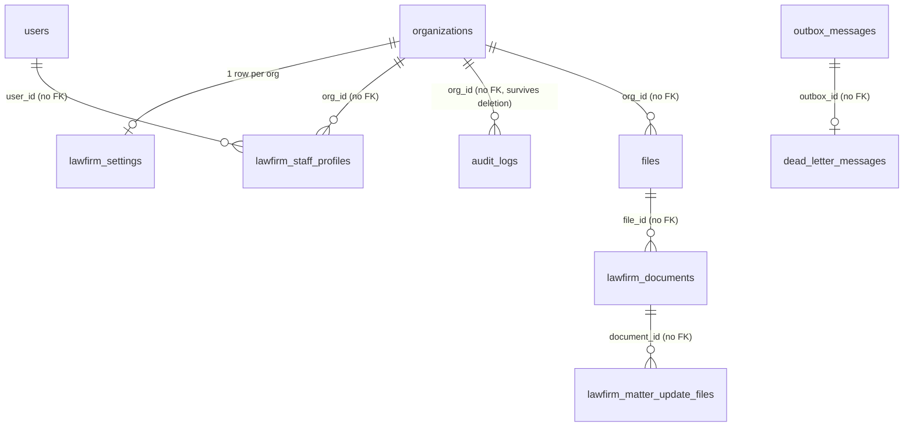

# Database ERD

Full entity–relationship diagram for the Mizan / AURIC Core database, generated
from the Prisma schema (`prisma/schema/*.prisma`). Table and column names are the
physical (snake_case) names.

Notes:

- **Multi-tenancy:** every `lawfirm_*` table and most Core tables carry
  `organization_id` and are isolated by Postgres RLS (`docs/tenancy.md`). Only the
  real foreign keys are drawn below; the tenant column is on nearly every table.
- **No-FK-by-design tables:** `audit_logs`, `files`, `outbox_messages`,
  `dead_letter_messages`, `notification_templates`, `lawfirm_activity_entries`,
  `lawfirm_reminders`, and `lawfirm_staff_profiles` keep plain columns (no FK) so
  the data can outlive an organization / user deletion, or because the reference
  crosses a module boundary (`lawfirm_documents.file_id` → `files.id`).
- Prisma cannot express some constraints (audit immutability trigger, outbox
  partial index / CHECK); those live in `prisma/migrations/`.

```mermaid
erDiagram
    %% ---------- core/identity ----------
    users {
        string id PK
        string email
        string email_normalized UK
        string password_hash
        string display_name
        string status
        datetime email_verified_at
        string locale
        datetime created_at
        datetime updated_at
    }
    refresh_tokens {
        string id PK
        string user_id FK
        string token_hash UK
        datetime expires_at
        datetime revoked_at
        string rotated_to
        string user_agent
        datetime created_at
    }
    verification_tokens {
        string id PK
        string user_id FK
        string purpose
        string token_hash UK
        datetime expires_at
        datetime consumed_at
        datetime created_at
    }

    %% ---------- core/organizations ----------
    organizations {
        string id PK
        string name
        string slug UK
        json settings
        datetime created_at
        datetime updated_at
    }
    organization_members {
        string id PK
        string organization_id FK
        string user_id FK
        string membership_role
        datetime joined_at
    }

    %% ---------- core/rbac ----------
    roles {
        string id PK
        string key UK
        string name
        string description
        boolean is_system
        datetime created_at
        datetime updated_at
    }
    permissions {
        string id PK
        string key UK
        string action
        string resource
        string description
        datetime created_at
    }
    role_permissions {
        string role_id PK,FK
        string permission_id PK,FK
    }
    user_roles {
        string user_id PK,FK
        string role_id PK,FK
        string organization_id PK,FK
        datetime granted_at
        string granted_by
    }

    %% ---------- core/notifications ----------
    notifications {
        string id PK
        string user_id FK
        string organization_id FK
        string type
        string title
        string body
        string locale
        json data
        datetime read_at
        datetime created_at
    }
    notification_templates {
        string id PK
        string key
        string locale
        string channel
        string subject
        string body
        datetime created_at
        datetime updated_at
    }

    %% ---------- core/audit ----------
    audit_logs {
        string id PK
        string organization_id
        string actor_id
        string actor_type
        string action
        string resource_type
        string resource_id
        json before
        json after
        json metadata
        string correlation_id
        datetime created_at
    }

    %% ---------- core/events (outbox) ----------
    outbox_messages {
        string id PK
        string organization_id
        string event_name
        json payload
        string status
        int attempts
        int max_attempts
        datetime next_attempt_at
        string last_error
        datetime locked_at
        datetime created_at
        datetime delivered_at
    }
    dead_letter_messages {
        string id PK
        string organization_id
        string outbox_id
        string event_name
        json payload
        int attempts
        string last_error
        json retry_history
        datetime created_at
        datetime replayed_at
    }

    %% ---------- core/files ----------
    files {
        string id PK
        string organization_id
        string storage_key
        string driver
        string original_name
        string content_type
        bigint byte_size
        string checksum_sha256
        string owner_id
        string visibility
        json metadata
        datetime created_at
        datetime deleted_at
    }

    %% ---------- lawfirm/settings ----------
    lawfirm_settings {
        string organization_id PK
        string firm_name
        string registration_number
        string address
        string default_currency
        decimal vat_rate
        string_array matter_types
        string_array courts
        json standard_rates
        boolean ai_assistant_enabled
        datetime created_at
        datetime updated_at
    }

    %% ---------- lawfirm/staff ----------
    lawfirm_staff_profiles {
        string id PK
        string organization_id
        string user_id
        string title
        string phone
        string_array practice_areas
        string status
        int weekly_capacity_hours
        string bar_admission
        datetime created_at
        datetime updated_at
    }

    %% ---------- lawfirm/crm ----------
    lawfirm_clients {
        string id PK
        string organization_id
        string name
        string type
        string status
        string email
        string phone
        string tax_id
        string address
        string notes
        datetime created_at
        datetime updated_at
    }
    lawfirm_contacts {
        string id PK
        string organization_id
        string client_id FK
        string name
        string role
        string email
        string phone
        boolean is_primary
        datetime created_at
        datetime updated_at
    }

    %% ---------- lawfirm/matters ----------
    lawfirm_matters {
        string id PK
        string organization_id
        string reference
        string title
        string client_id FK
        string practice_area
        string status
        string court
        string lead_lawyer_id
        datetime opened_at
        datetime closed_at
        string description
        datetime created_at
        datetime updated_at
    }
    lawfirm_matter_participants {
        string id PK
        string organization_id
        string matter_id FK
        string user_id
        string role
        datetime created_at
    }
    lawfirm_matter_updates {
        string id PK
        string organization_id
        string matter_id FK
        string author_id
        string body
        datetime created_at
    }
    lawfirm_matter_update_files {
        string id PK
        string organization_id
        string matter_update_id FK
        string document_id
        datetime created_at
    }
    lawfirm_matter_notes {
        string id PK
        string organization_id
        string matter_id FK
        string author_id
        string body
        datetime created_at
        datetime updated_at
    }

    %% ---------- lawfirm/calendar ----------
    lawfirm_hearings {
        string id PK
        string organization_id
        string matter_id FK
        string court
        datetime scheduled_at
        string status
        string purpose
        string outcome
        datetime created_at
        datetime updated_at
    }
    lawfirm_calendar_events {
        string id PK
        string organization_id
        string title
        string kind
        datetime start_at
        datetime end_at
        string matter_id FK
        string owner_id
        datetime created_at
        datetime updated_at
    }

    %% ---------- lawfirm/tasks ----------
    lawfirm_tasks {
        string id PK
        string organization_id
        string title
        string matter_id FK
        string assignee_id
        string status
        string priority
        datetime due_at
        datetime completed_at
        datetime created_at
        datetime updated_at
    }

    %% ---------- lawfirm/documents ----------
    lawfirm_documents {
        string id PK
        string organization_id
        string name
        string matter_id FK
        string category
        string status
        string file_id
        bigint size_bytes
        string mime_type
        string uploaded_by_id
        datetime uploaded_at
        datetime created_at
        datetime updated_at
    }

    %% ---------- lawfirm/billing ----------
    lawfirm_invoices {
        string id PK
        string organization_id
        string number
        string client_id FK
        string matter_id FK
        string status
        string currency
        datetime issued_at
        datetime due_at
        decimal vat_rate
        datetime created_at
        datetime updated_at
    }
    lawfirm_invoice_lines {
        string id PK
        string organization_id
        string invoice_id FK
        string kind
        string description
        decimal amount
        datetime created_at
    }
    lawfirm_payments {
        string id PK
        string organization_id
        string invoice_id FK
        decimal amount
        string currency
        string method
        datetime received_at
        string reference
        datetime created_at
    }
    lawfirm_expenses {
        string id PK
        string organization_id
        string matter_id FK
        string description
        string category
        decimal amount
        string currency
        string status
        datetime incurred_at
        string submitted_by_id
        datetime created_at
        datetime updated_at
    }

    %% ---------- lawfirm/activity ----------
    lawfirm_activity_entries {
        string id PK
        string organization_id
        string actor_id
        string action
        string target_type
        string target_id
        string target_label
        datetime at
        datetime created_at
    }
    lawfirm_reminders {
        string id PK
        string organization_id
        string matter_id
        string title
        datetime due_at
        datetime done_at
        string owner_id
        datetime created_at
        datetime updated_at
    }

    %% ---------- relationships (declared foreign keys) ----------
    users ||--o{ refresh_tokens : "has"
    users ||--o{ verification_tokens : "has"
    users ||--o{ organization_members : "joins"
    users ||--o{ user_roles : "granted"
    users ||--o{ notifications : "receives"

    organizations ||--o{ organization_members : "has"
    organizations ||--o{ user_roles : "scopes"
    organizations |o--o{ notifications : "scopes"

    roles ||--o{ role_permissions : "grants"
    permissions ||--o{ role_permissions : "granted via"
    roles ||--o{ user_roles : "assigned"

    lawfirm_clients ||--o{ lawfirm_contacts : "has"
    lawfirm_clients ||--o{ lawfirm_matters : "has"
    lawfirm_clients ||--o{ lawfirm_invoices : "billed"

    lawfirm_matters ||--o{ lawfirm_matter_participants : "has"
    lawfirm_matters ||--o{ lawfirm_matter_updates : "has"
    lawfirm_matters ||--o{ lawfirm_matter_notes : "has"
    lawfirm_matters ||--o{ lawfirm_hearings : "has"
    lawfirm_matters |o--o{ lawfirm_tasks : "has"
    lawfirm_matters |o--o{ lawfirm_documents : "has"
    lawfirm_matters |o--o{ lawfirm_invoices : "has"
    lawfirm_matters |o--o{ lawfirm_expenses : "has"
    lawfirm_matters |o--o{ lawfirm_calendar_events : "linked"

    lawfirm_matter_updates ||--o{ lawfirm_matter_update_files : "attaches"

    lawfirm_invoices ||--o{ lawfirm_invoice_lines : "has"
    lawfirm_invoices ||--o{ lawfirm_payments : "receives"
```

## Logical references (no database FK)

