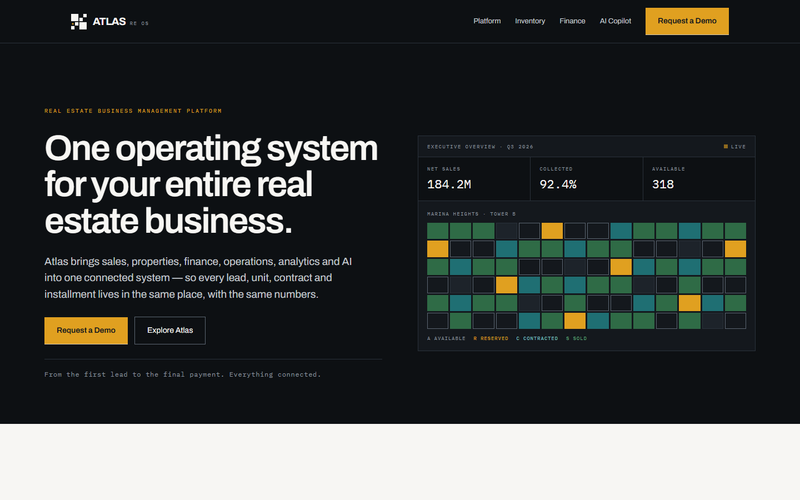
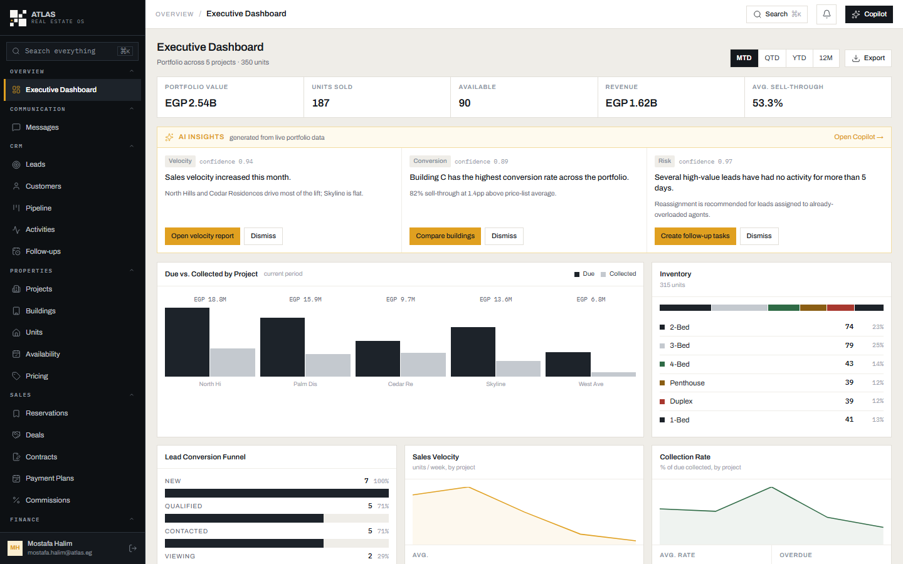
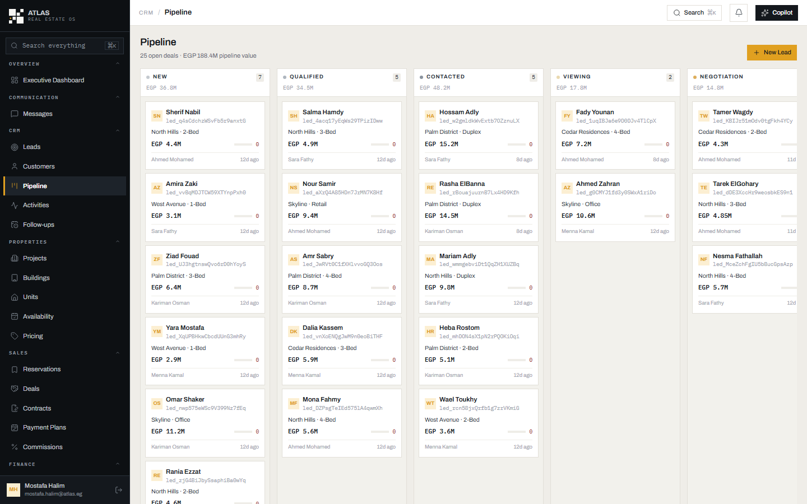
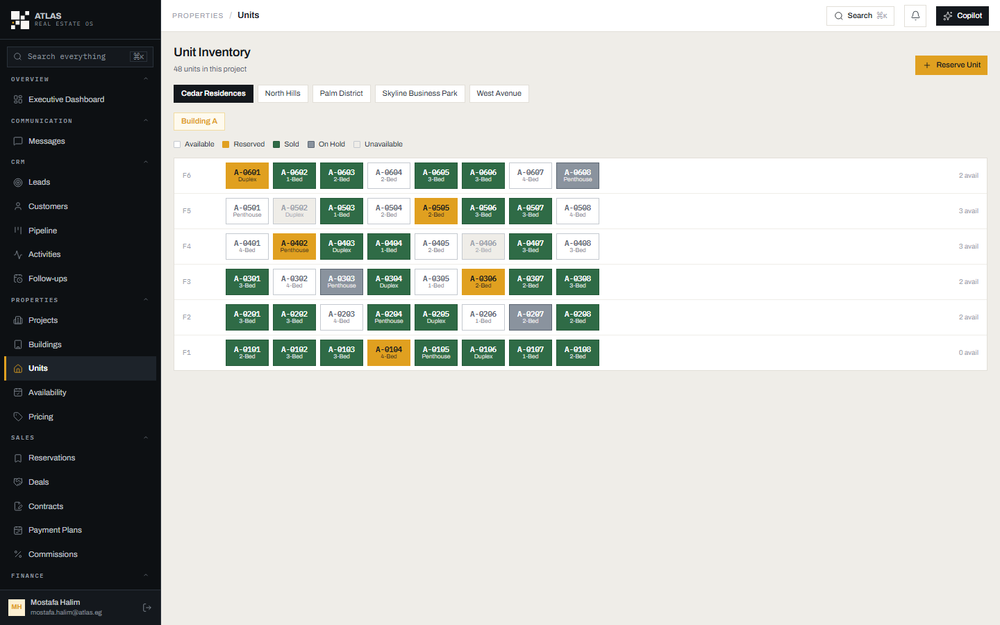
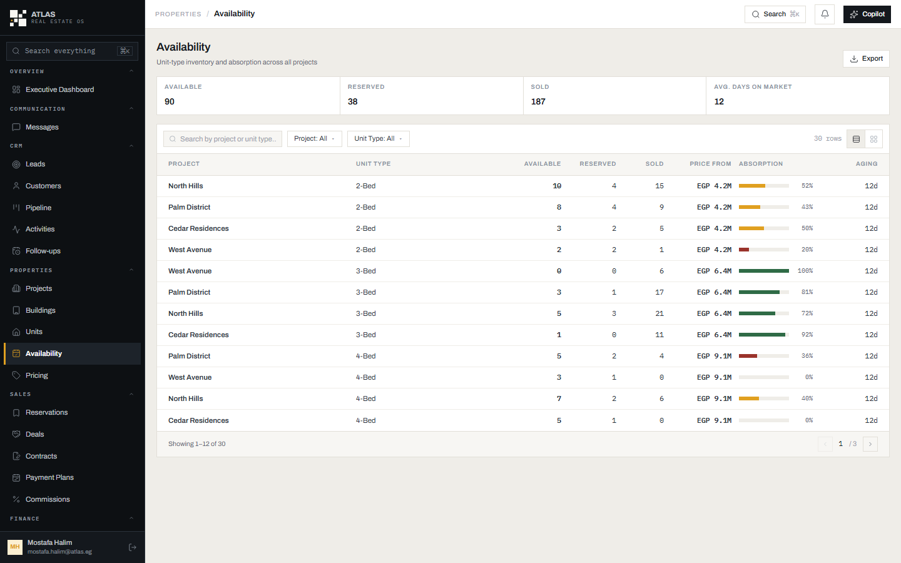
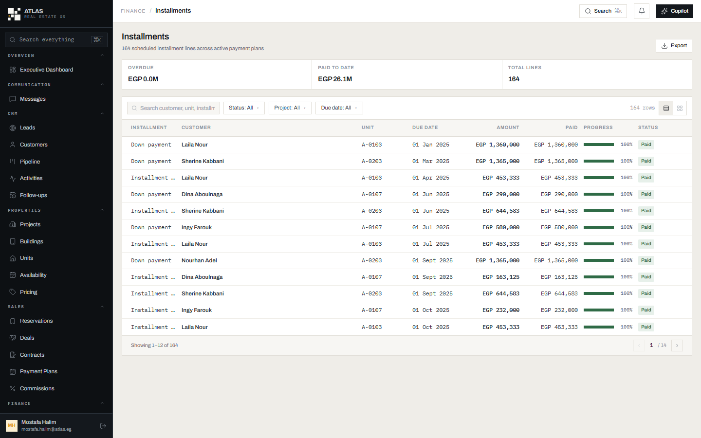
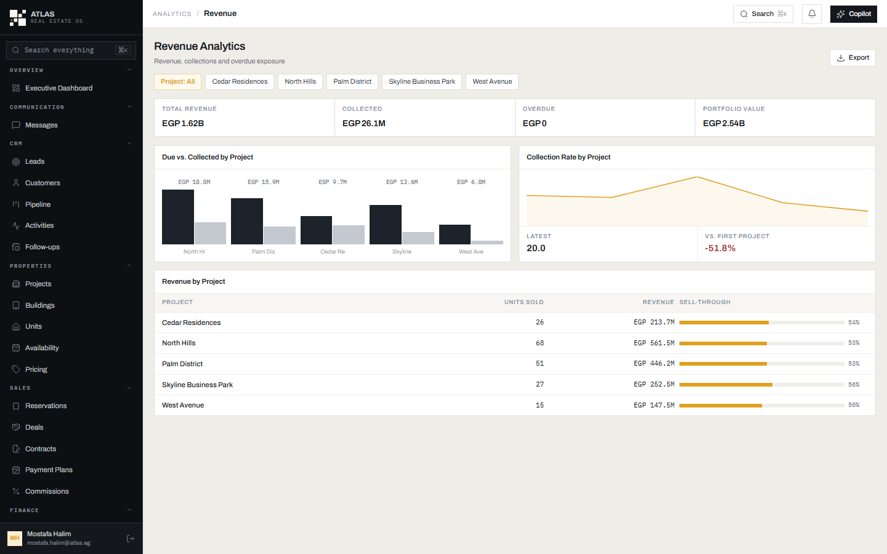
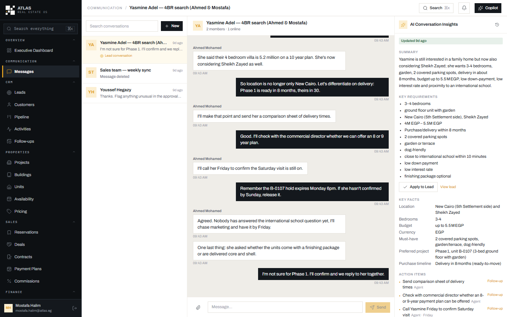

# Atlas: real-estate developer OS

| [Overview](../../README.md) | [Mizan](mizan.md) | **Atlas** | [HotelOS](hotelos.md) | [Raqib](raqib.md) | [Admit](admit.md) | [Security](../../SECURITY.md) |
|:---:|:---:|:---:|:---:|:---:|:---:|:---:|

Atlas is the operating system for a property developer's sales and finance team. It covers CRM, property
inventory, sales, payment plans and collections, following a buyer from the first lead to the last
installment. It's the second product on Project-404 Core, built in a completely different domain to prove
the foundation was really reusable.

**Live:** [atlas.100-26-109-162.sslip.io](https://atlas.100-26-109-162.sslip.io) (its own VPS deployment
and its own database, with no infrastructure shared with Mizan).



---

## Screenshots

| | |
|---|---|
| **Executive dashboard:** portfolio value, sales, AI insights from live data  | **Pipeline:** every open deal by stage, with value and agent  |
| **Unit inventory:** each building floor by floor, color-coded by status  | **Availability:** stock and absorption by project and unit type  |
| **Installments:** every scheduled payment line across payment plans  | **Revenue analytics:** due vs collected, collection rate, sell-through  |
| **Messages with AI insights:** the conversation is summarized into requirements, facts and action items  | |

All data shown is synthetic demo data.

## What it covers

| Area | Screens |
|---|---|
| **Overview** | Executive dashboard |
| **Communication** | Real-time messages, with AI conversation insights |
| **CRM** | Leads · Customers · Pipeline (kanban) · Activities · Follow-ups |
| **Properties** | Projects · Buildings · Units · Availability · Pricing |
| **Sales** | Reservations · Deals · Contracts · Payment plans · Commissions |
| **Finance** | Payments · Installments · Collections · Outstanding payments · Financial reports |
| **Operations** | Tasks · Workflows · Approvals · Documents |
| **Analytics** | Sales · Leads · Projects · Agents · Revenue · Inventory |
| **AI** | Copilot · Insights · Recommendations |
| **Administration** | Team · Roles and permissions · Organization settings · Audit log |

The full lifecycle: a lead comes in, moves through the pipeline, reserves a unit, signs a contract and goes
on a payment plan. Finance then collects the installments and the reports roll everything up.

## Highlights

- **Atlas Copilot.** An assistant that answers questions about the portfolio ("which projects have the
  highest sales velocity?") and can create and update tasks. It has 22 tools (20 read, 2 write) over the app's
  existing use cases. There's no generic SQL tool, so the model can't touch the database directly.
- **Security doesn't depend on the prompt.** The model picks which tool to call, but every call is checked
  again against the user's permissions and tenant. 33 security tests cover cross-tenant reads, denied roles,
  prompt injection hidden in lead notes, and requests that try to smuggle in another `organizationId`.
- **Conversation intelligence.** Linking a chat to a lead makes Atlas extract the buyer's requirements, key
  facts and action items, which can be applied to the lead in one click.
- **Real search.** Every list has server-side search ranked in SQL (exact match, then prefix, then word, then
  substring, weighted by column). Every filter is a real query parameter.
- **Honest numbers.** KPI totals are queried separately from the filtered list, so they don't quietly shrink
  when a filter is applied.

## How it's built

```
atlas/
├── backend/        @atlas/backend: its own package, Prisma migrations and `atlas` database
│   └── app/realestate/   8 domain modules: CRM, properties, sales, finance, operations,
│                         admin, dashboard, assistant (23 tables with row-level security)
└── web/            React 19 + Vite + Tailwind 4 + TanStack Query, HTTP only
```

Atlas reaches Core only through contract interfaces (`IUserProvider`, `IPermissionProvider`,
`ITenantContext`, `IFileStorage`, `IAuditLogger`, `IEventBus`) and never touches a Core table directly.
Money is stored as `{ currency, amount }` and never summed across currencies. Atlas is English-only by design.

## Run it locally

```bash
cd atlas/backend && npm install
cp .env.example .env            # points at its own `atlas` database, never Mizan's
createdb atlas
ATLAS_SEED_DEMO=true npm run serve              # :3100
cd ../web && npm install && npm run dev         # http://localhost:4400
```

## Demo accounts

The password is `demo-password-2026` for every account.

| Login | Role |
|---|---|
| `mostafa.halim@atlas.eg` | Administrator |
| `ahmed.m@atlas.eg` | Sales agent |
| `youssef.h@atlas.eg` | Sales manager |
| `nadine.f@atlas.eg` | Finance controller |

## Tests

| Suite | Command | Tests |
|---|---|---|
| Backend | `cd atlas/backend && npm test` | 80 (including tenant isolation and a live AI-provider suite) |
| Web | `cd atlas/web && npm test` | 5 |

## Known limitations

- Copilot answers are shown as plain text, so markdown formatting from the model (like `**bold**`) appears
  as raw symbols.
- Atlas isn't in the GitHub CI workflow yet; it's verified by hand.

## More

[docs/atlas-assistant.md](../atlas-assistant.md) (Copilot) · [docs/messaging.md](../messaging.md) ·
[docs/atlas-deployment.md](../atlas-deployment.md) · [docs/lead-intelligence.md](../lead-intelligence.md)
