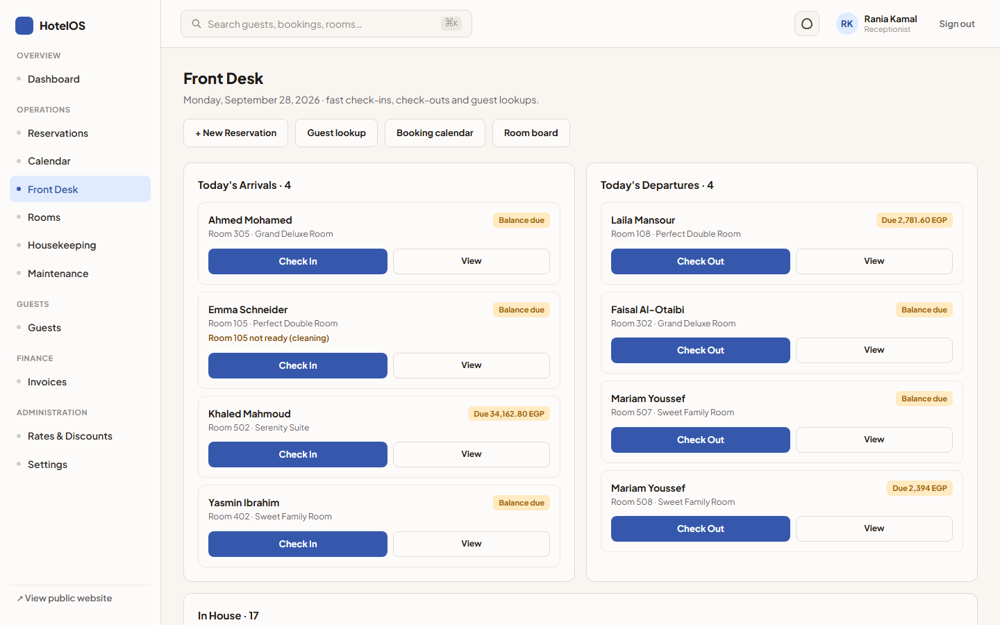
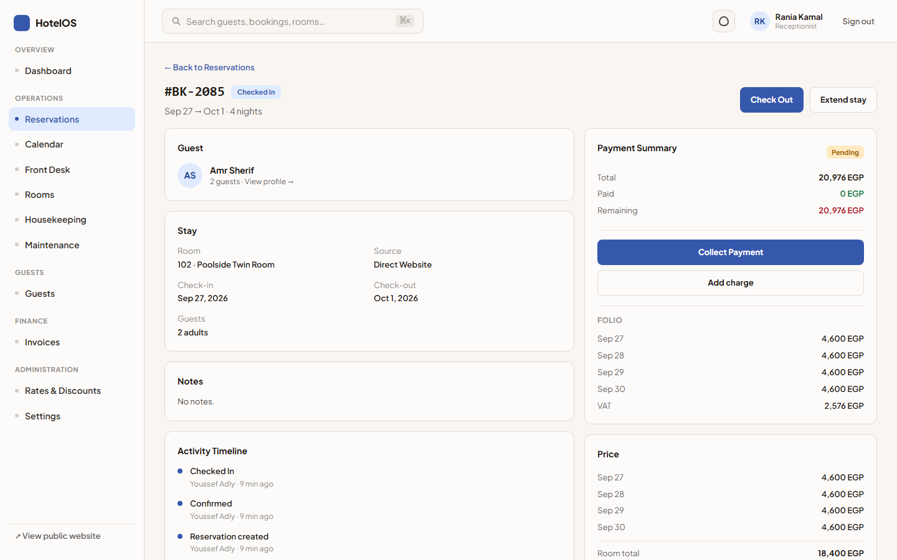
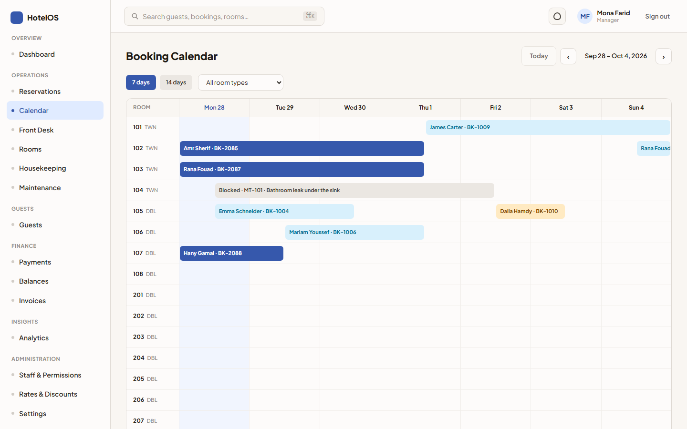
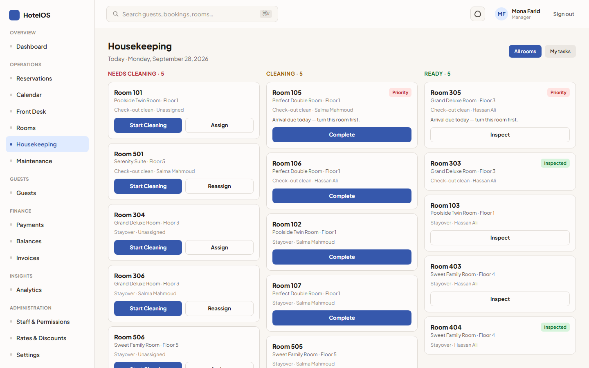
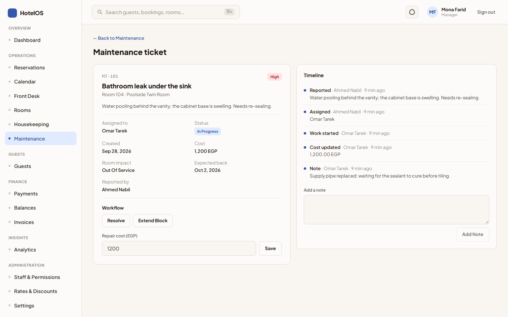
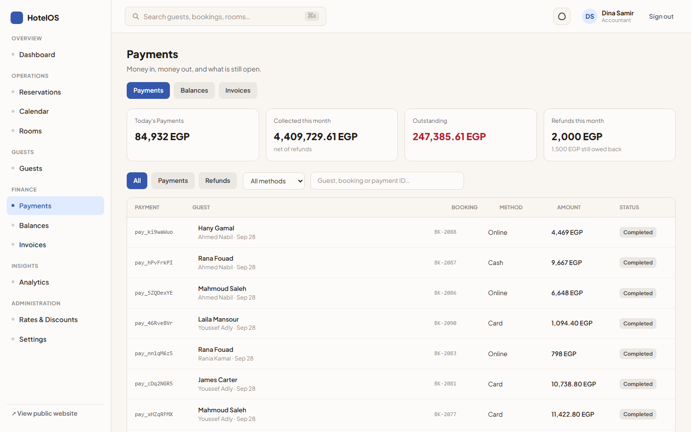
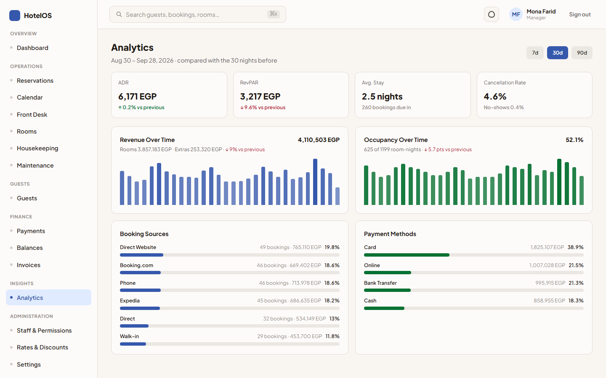
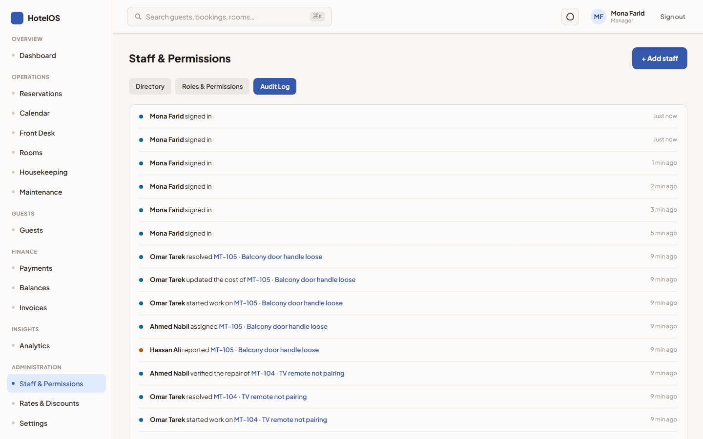
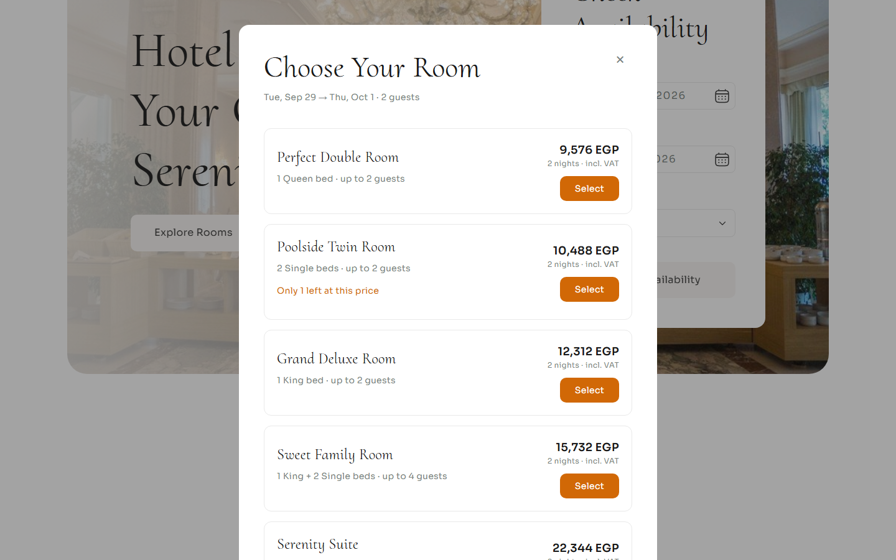

# HotelOS: hotel operations

| [Overview](../../README.md) | [Mizan](mizan.md) | [Atlas](atlas.md) | **HotelOS** | [Raqib](raqib.md) | [Admit](admit.md) | [Security](../../SECURITY.md) |
|:---:|:---:|:---:|:---:|:---:|:---:|:---:|

HotelOS runs **Hotel Transylvania**, a four-star Nile-side hotel in Cairo. It covers reservations, the front
desk, housekeeping, maintenance, finance and analytics, plus the public website where guests book. It's the
third product on Project-404 Core and was built in eight vertical slices, each passing the full test gate
before the next one started.

**Public website:** [hotel-nayel.vercel.app](https://hotel-nayel.vercel.app). The staff app and API run
locally for now; see [Known limitations](#known-limitations).


---

## Screenshots

| | |
|---|---|
| **Front desk:** arrivals, departures and in-house guests  | **Reservation and folio:** stay details, charges, payments, balance  |
| **Calendar:** room-by-night availability  | **Housekeeping board:** rooms to clean, in progress, inspected  |
| **Maintenance ticket:** assignment, cost, room out of sale  | **Payments ledger:** every payment and refund  |
| **Analytics:** occupancy, ADR, RevPAR, revenue, channels  | **Audit log:** who did what, as a readable feed  |
| **Hotel Transylvania website:** a guest booking online  | |

All data shown is synthetic demo data.

## Who uses it

| Role | What they do |
|---|---|
| **Owner / Manager** | Dashboard, analytics, rates and discounts, staff and roles, settings, audit log |
| **Receptionist** | Reservations, calendar, front desk: check-in, check-out, folio, payments, extending stays |
| **Accountant** | Payments ledger, refunds, invoices (void and re-issue), outstanding balances |
| **Housekeeping** | The cleaning board: start and complete rooms. Supervisors assign and inspect. |
| **Maintenance** | Tickets: start, resolve, record cost and notes. Supervisors take rooms out of sale and verify repairs. |
| **Guest** | Books on the public website and pays at the hotel |

## Lifecycles

Every lifecycle is a state machine enforced on the server:

| Record | States |
|---|---|
| Reservation | Pending → Confirmed → Checked-in → Checked-out · Cancelled · No-show |
| Housekeeping task | Pending → Assigned → In progress → Completed → Inspected |
| Maintenance ticket | Open → Assigned → In progress → Resolved → Verified (can reopen from Resolved) |
| Payment / refund | Pending → Completed · Failed (the provider is called outside the database transaction) |

## Highlights

- **No double booking, enforced by PostgreSQL.** Reservations and maintenance blocks share one allocation
  ledger with an exclusion constraint over room-nights. Two concurrent bookings for the last room can't both
  succeed, and tests race them to prove it.
- **Money is a ledger.** There's no `isPaid` flag. Balances are derived from charges, payments and refunds.
  Payments and refunds carry idempotency keys, so a retry can't charge or refund twice.
- **Public booking API.** The website books through a public endpoint that requires an `Idempotency-Key` and
  is rate-limited per client address, with counters shared across server instances.
- **Background jobs.** Scheduled jobs mark no-shows and release booking holds nobody confirmed within 48
  hours. They go through the same state machine as staff, recorded as "System", and are safe to run twice.
- **Real demo history.** The demo hotel is seeded by playing 120 days of bookings through the real workflows,
  so every dashboard and report has real data behind it.
- **Command palette.** ⌘K searches guests, reservations, rooms, invoices and maintenance tickets from anywhere in the staff app.

## How it's built

```
hotel-project/
├── backend/        @hotel/backend: NestJS on Core, its own `hotelos` database, port 3200
│   └── docs/architecture.md    the decision log, slice by slice
├── app/            staff app: React 19 + Vite, port 4600, and the Playwright E2E suite
└── web/            the public Hotel Transylvania website, port 4500
```

## Run it locally

```bash
cd hotel-project/backend
cp .env.example .env            # set HOTEL_SEED_DEMO=true for the demo hotel
createdb hotelos
npm run dev                     # migrates, seeds, serves :3200 (docs: /api/docs)
cd ../app && npm install && npm run dev         # staff app: http://localhost:4600
cd ../web && npm install && npm run dev         # website: http://localhost:4500
```

The first boot seeds the demo hotel, which takes about a minute.

## Demo accounts

The password is `demo-password-2026` for every account.

| Login | Role |
|---|---|
| `ahmed.nabil@hoteltransylvania.com` | Owner |
| `mona.farid@hoteltransylvania.com` | Manager |
| `rania.kamal@hoteltransylvania.com` · `youssef.adly@hoteltransylvania.com` | Receptionist |
| `dina.samir@hoteltransylvania.com` | Accountant |
| `hassan.ali@hoteltransylvania.com` · `salma.mahmoud@hoteltransylvania.com` | Housekeeping |
| `omar.tarek@hoteltransylvania.com` | Maintenance |

## Tests

| Suite | Command | What it covers |
|---|---|---|
| Backend | `cd hotel-project/backend && npm run ci` | typecheck · lint · format · 139 unit and integration tests (including booking races) · build |
| Staff app | `cd hotel-project/app && npm run ci` | typecheck · lint · format · 58 tests · build |
| End to end | `cd hotel-project/app && npm run e2e` | Playwright against the real backend, staff app and website: 27 scenarios on desktop and phone |

## Known limitations

- **The API and staff app aren't deployed yet.** Only the public website is live, so its booking form won't
  reach a server until the API is deployed.
- **Payments are simulated.** A `PaymentProvider` interface is in place for a real gateway; guests pay at the
  hotel.
- **English only, one property per organization.**
- **The role matrix is read-only**, because Core roles are global per deployment.

## More

[hotel-project/README.md](../../hotel-project/README.md) ·
[hotel-project/backend/docs/architecture.md](../../hotel-project/backend/docs/architecture.md)
