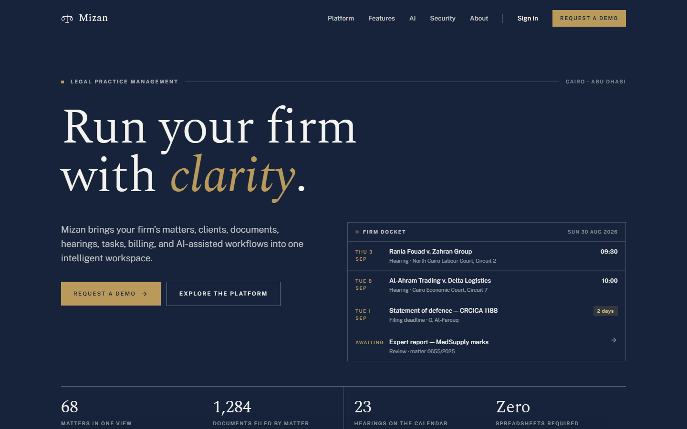
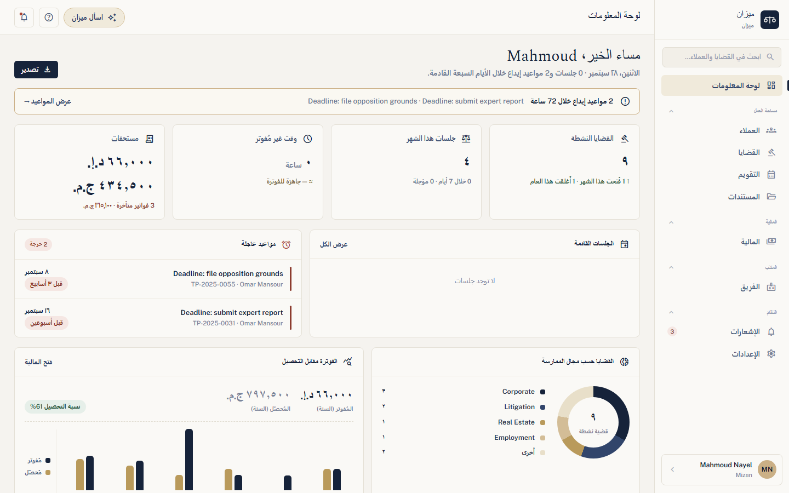
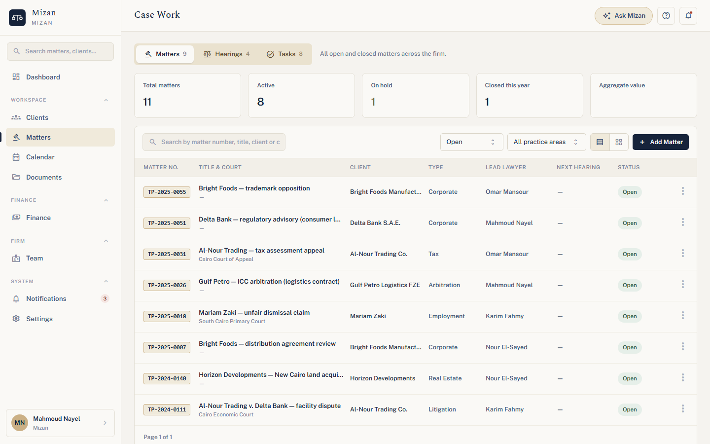
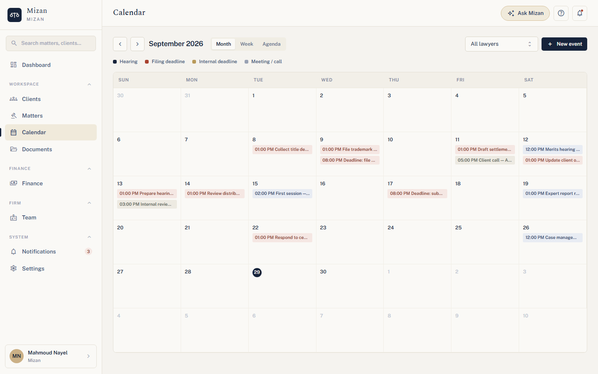
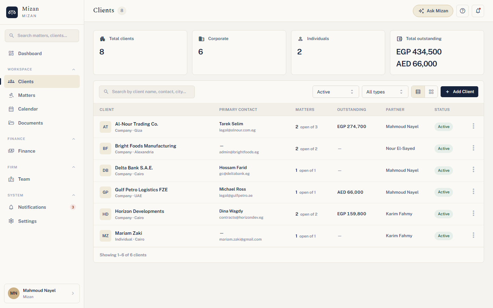
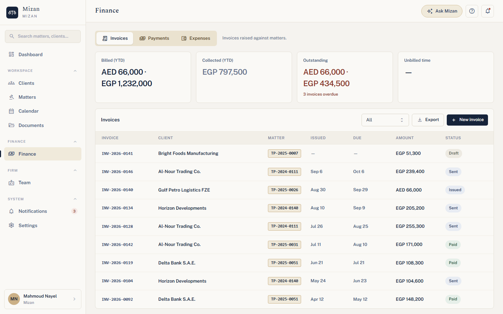
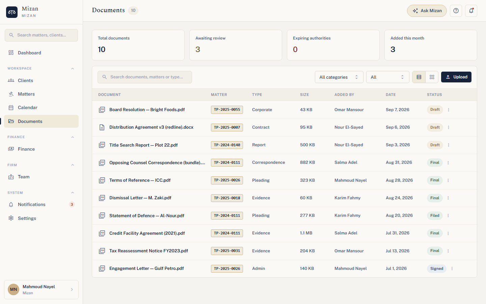

# Mizan: law-firm management

| [Overview](../../README.md) | **Mizan** | [Atlas](atlas.md) | [HotelOS](hotelos.md) | [Raqib](raqib.md) | [Security](../../SECURITY.md) |
|:---:|:---:|:---:|:---:|:---:|:---:|

Mizan is the first product built on Project-404 Core. It runs a law firm's matters, clients, hearings,
deadlines, documents, time and billing in one workspace. It's bilingual: English by default, and Arabic
with full right-to-left layout one switch away. A native mobile app uses the same API.

**Live:** [mizan-web-seven.vercel.app](https://mizan-web-seven.vercel.app) (web, on Vercel) talking to
the API on an AWS VPS.



---

## Screenshots

| | |
|---|---|
| **Dashboard:** matters, hearings, deadlines, billing vs collections  | **The same dashboard in Arabic**, fully right-to-left  |
| **Case work:** every matter with its client, type, lawyer and status  | **Calendar:** hearings, filing deadlines, meetings  |
| **Clients:** matters and outstanding balance per client  | **Finance:** invoices per matter, in each invoice's own currency  |
| **Documents:** filed by matter, with review status  | |

All data shown is synthetic demo data.

## Who uses it

| Role | What they do |
|---|---|
| **Firm admin / Partner** | Run the firm: users and roles, settings, audit log, dashboards, billing oversight |
| **Lawyer** | Clients and matters, hearings, tasks, documents, time and disbursements |
| **Paralegal** | Supports the case work: documents, calendar, tasks |
| **Finance** | Invoices, payments, expenses, collections |

## What it does

- **Matters and case work.** Every matter has its client, court, practice area, lead lawyer, hearings,
  tasks and documents. Hearings and tasks have their own tabs.
- **Calendar and deadlines.** Hearings, filing deadlines, internal deadlines and client calls in a month,
  week or agenda view. The dashboard warns about deadlines due within 72 hours.
- **Documents.** Uploaded straight to storage through presigned URLs, filed by matter and tracked from draft
  to final, filed or signed.
- **Billing.** Invoices move through Draft → Issued → Sent → Paid (or Void). Every amount stays in its own
  currency (EGP, AED, …), and totals are never converted with an exchange rate.
- **Ask Mizan (AI).** A copilot that answers questions about the firm's matters, hearings, tasks and billing.
  It works through the same use cases as the UI and checks the user's permissions on every tool call.
- **Arabic and English.** Every screen is translated, with full RTL layout and Arabic number and date formats.
- **Mobile.** An Expo app with a today view, cases, calendar, files (with offline pinning), clients, finance
  and quick capture.
- **Admin.** Team management, roles and permissions, firm settings, notifications and an audit log.

## How it's built

```
mizan/
├── backend/app/lawfirm/    the law-firm domain: 11 feature modules, 19 tables with row-level security
├── web/                    React 19 + Vite + Tailwind 4, talks to the API over HTTP only
└── mobile/                 Expo / expo-router, the same API
```

The backend is the Mizan composition root: Core plus the `lawfirm` domain in one NestJS process, served from
`main.ts` at the repo root. The web and mobile apps never import backend code; they only use the HTTP API.
The Core ↔ Mizan boundary is documented in [docs/mizan-project-one.md](../mizan-project-one.md).

## Run it locally

With Docker (Postgres, migrations, database roles, demo firm and the API in one command):

```bash
docker compose up --build                       # API on :3000, docs at /api/docs
cd mizan/web && npm install && npm run dev      # http://localhost:4300
```

Without Docker:

```bash
cp .env.example .env
createdb auric
npm run migrate
AURIC_APP_DB_PASSWORD=app AURIC_SYSTEM_DB_PASSWORD=sys npm run provision-db   # once, enables RLS enforcement
npm run serve
```

## Demo accounts

The password is `demo-password-2026` for every account.

| Login | Role |
|---|---|
| `mahmoud.nayel@tawfikpartners.eg` | Firm admin |
| `omar.mansour@tawfikpartners.eg` | Lawyer |
| `salma.adel@tawfikpartners.eg` | Paralegal |

## Tests

| Suite | Command | Tests |
|---|---|---|
| Core + Mizan backend | `AURIC_TEST_DATABASE_URL=postgres://…/auric_test npm test` | 124 |
| Web | `cd mizan/web && npm test` | 78 |

## Known limitations

- The mobile app hasn't been tested on a physical device yet, and its "Ask Mizan" screen isn't connected to
  the assistant (the web app's is).
- Notifications and dashboards refresh on a timer rather than in real time.

## More

[mizan/README.md](../../mizan/README.md) · [docs/assistant.md](../assistant.md) (Ask Mizan) ·
[docs/deployment.md](../deployment.md) · [docs/tenancy.md](../tenancy.md)
