# Raqib: security quality and field inspection

| [Overview](../../README.md) | [Mizan](mizan.md) | [Atlas](atlas.md) | [HotelOS](hotelos.md) | **Raqib** | [Security](../../SECURITY.md) |
|:---:|:---:|:---:|:---:|:---:|:---:|

Raqib runs the quality function of a **security-guarding company**. Inspectors visit sites and fill in a
versioned checklist, quality staff review and approve every inspection, findings turn into corrective actions
with owners and deadlines, guards are scored and trained, and managers read compliance off the result. It's the
fourth product on Project-404 Core, built around an approved design in Arabic and English with full right-to-left
support.

**Live demo:** [raqib-web.vercel.app](https://raqib-web.vercel.app) (sign in with any account from the demo list below; the API runs on its own VPS, files on Cloudflare R2). How it is deployed: [docs/raqib-deployment.md](../raqib-deployment.md).

Inspectors work **offline** in the field: answers, notes and photos queue on the device and sync in order when
the signal returns. Everything else, from who may open a record to which form version an inspection used, is
decided and recorded by the server.

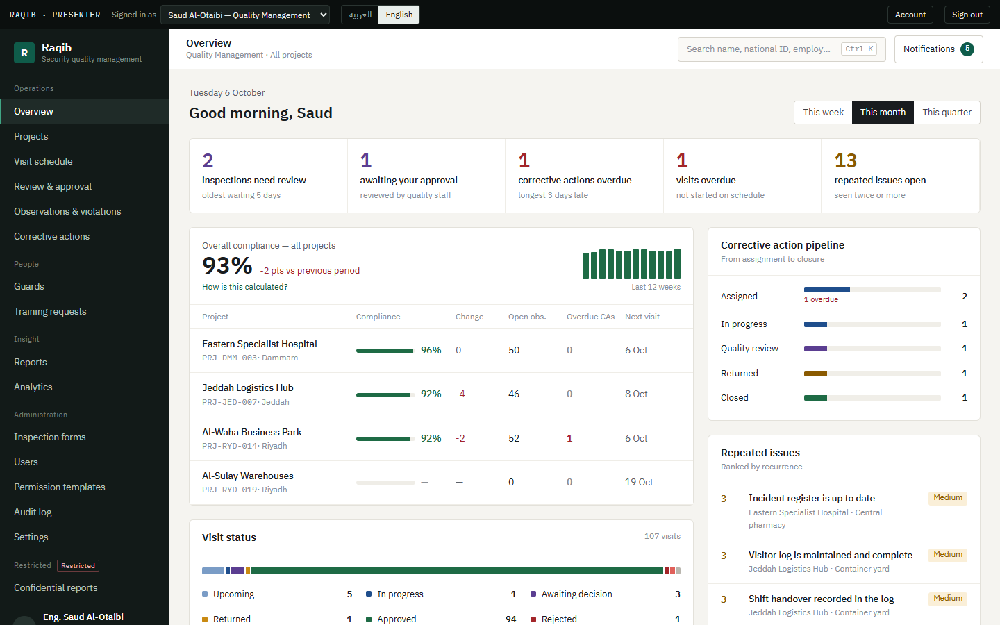

---

## Screenshots

| | |
|---|---|
| **Projects:** compliance, open observations and late actions per project 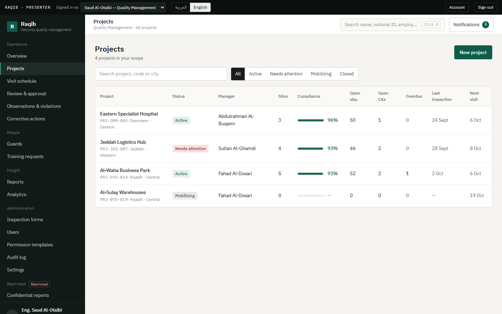 | **Project page:** quarterly score, weekly trend, sites and areas, open actions 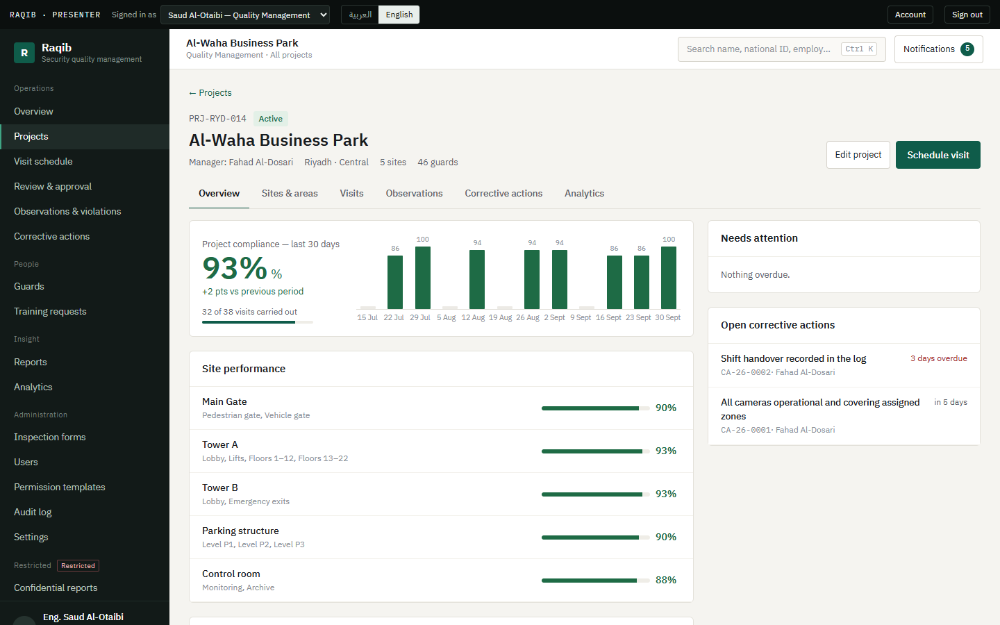 |
| **Visit schedule:** every planned, running and finished inspection 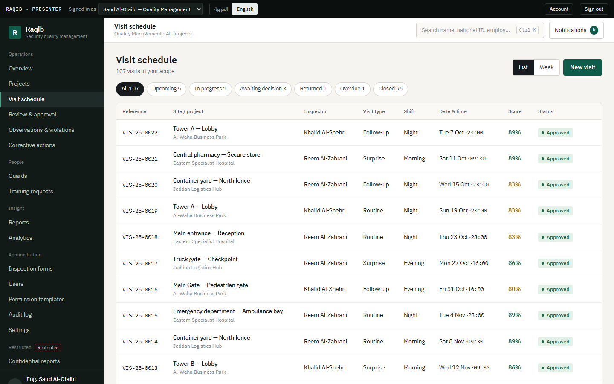 | **Inspection workspace:** the inspector's checklist, evidence and guard scoring 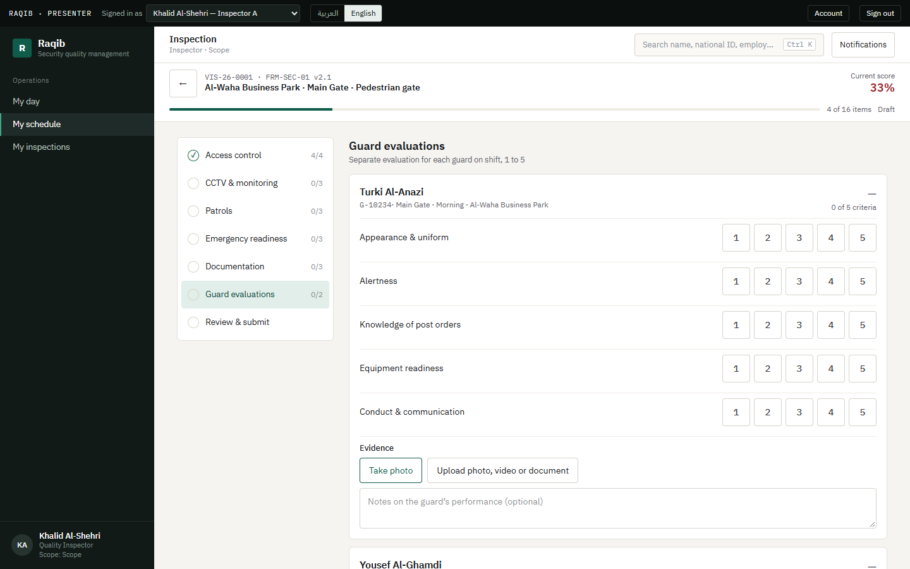 |
| **Review and approval:** flag items, return, reject or forward, then approve 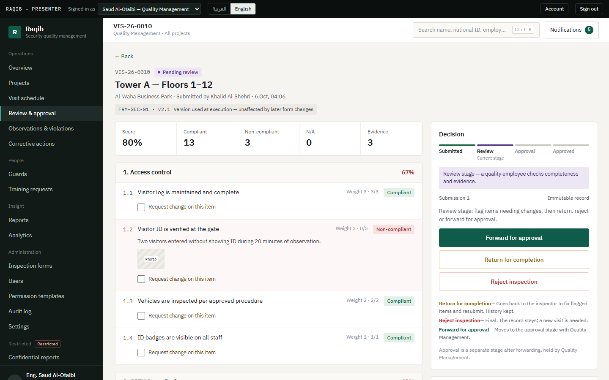 | **Observations:** every finding, with repeat counts across visits 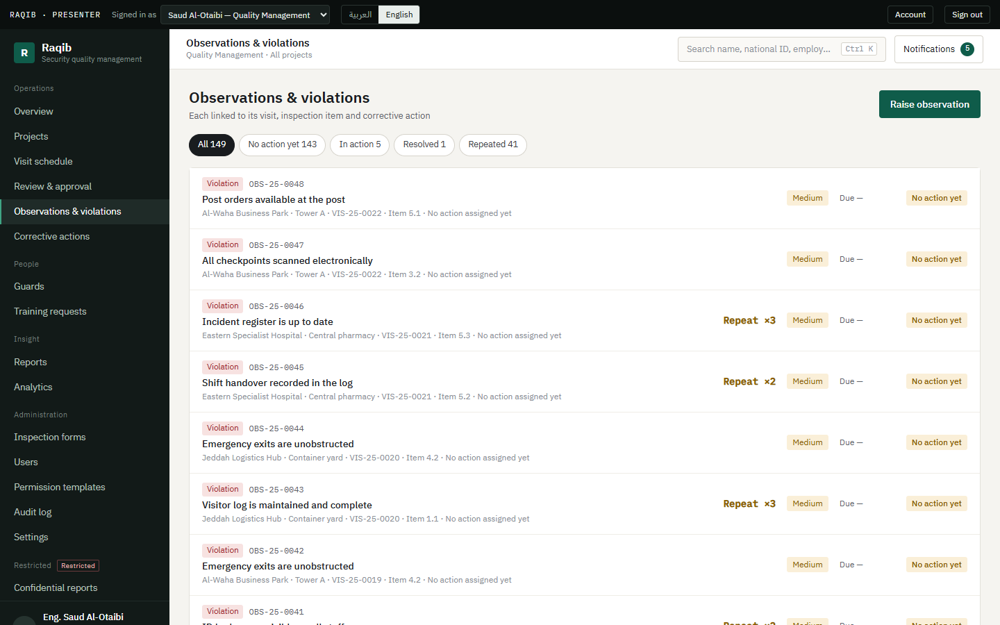 |
| **Corrective action:** owner, deadline, closure evidence, full history 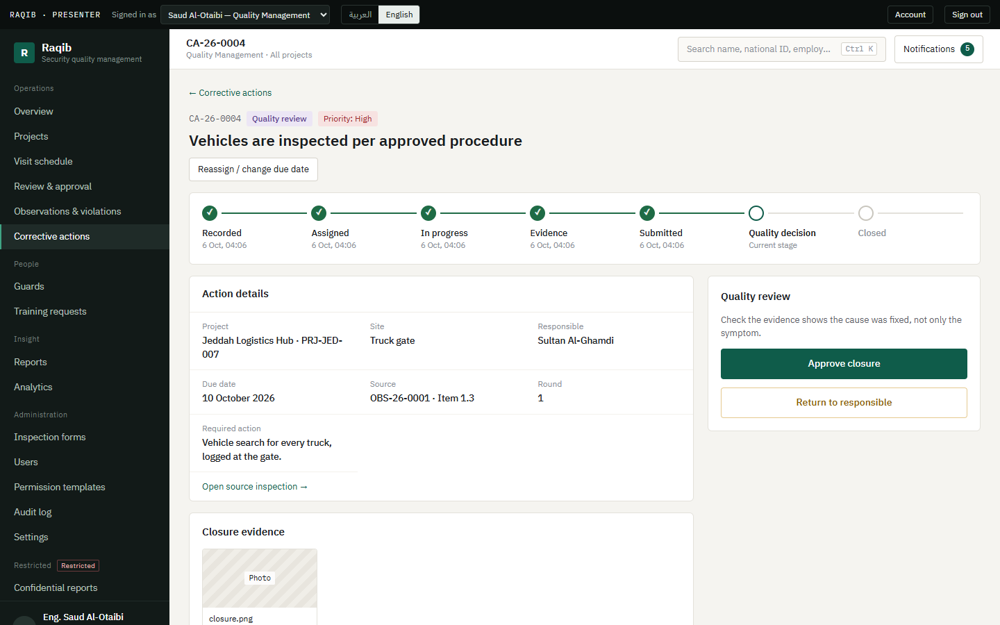 | **Guards:** the roster, each guard's average score and evaluations 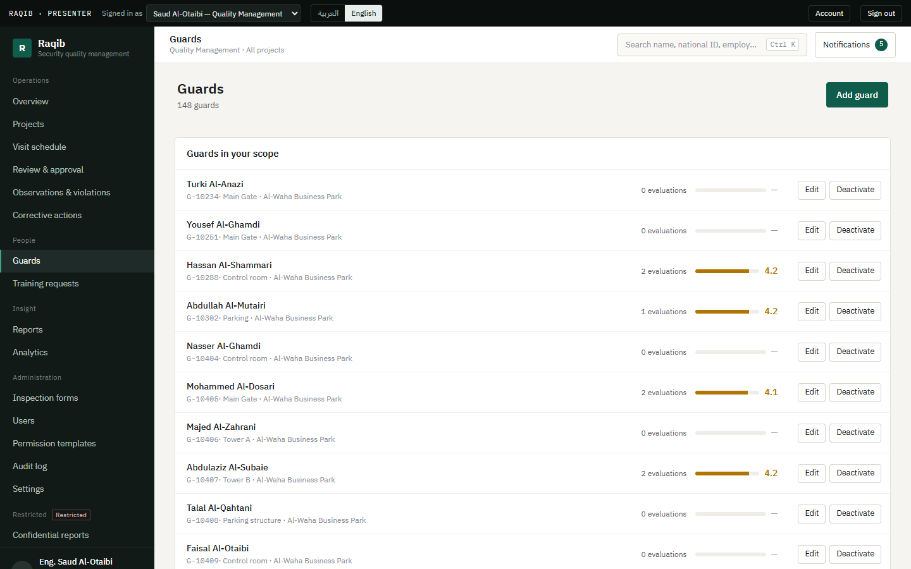 |
| **Analytics:** compliance trend, weak sections, site performance, CSV and Excel export 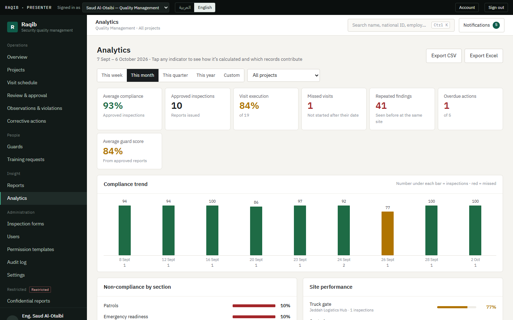 | **Issued reports:** frozen inspection reports with Arabic and English PDFs 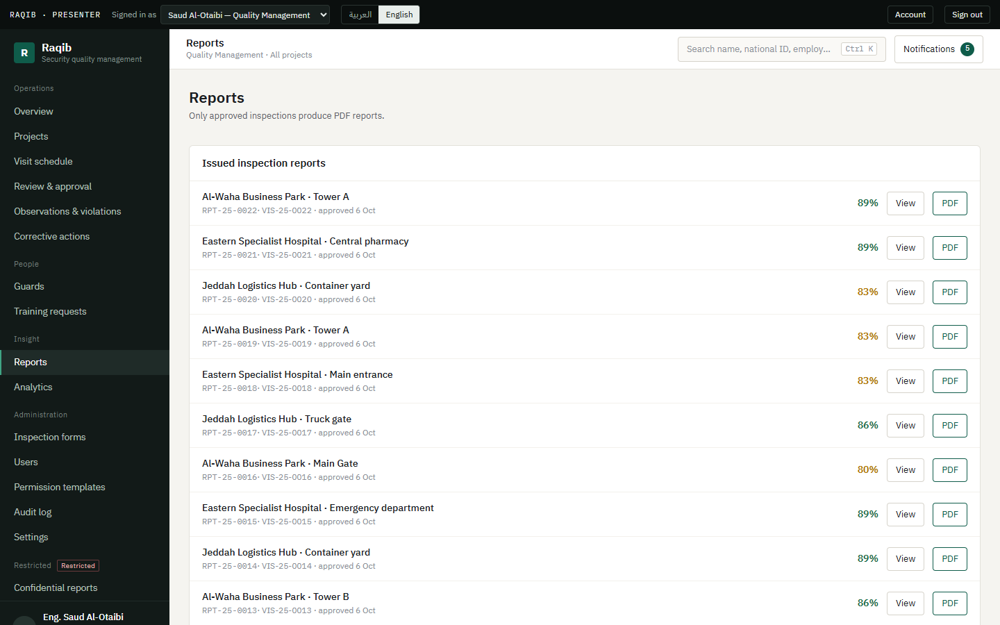 |
| **Audit log:** who did what and when, searchable and exportable 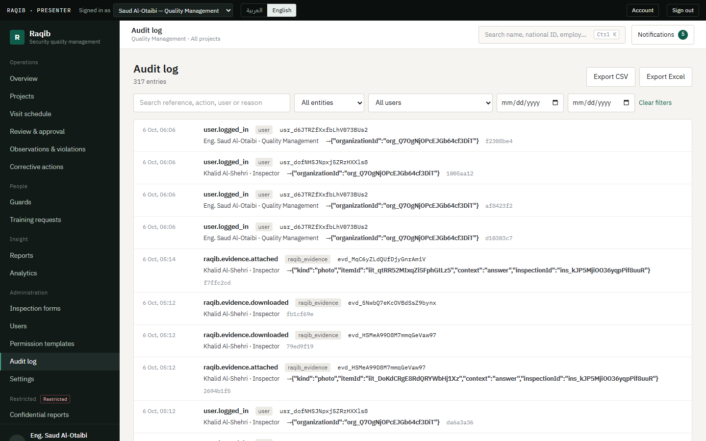 | **Inspection forms:** versioned checklists, only a draft is editable 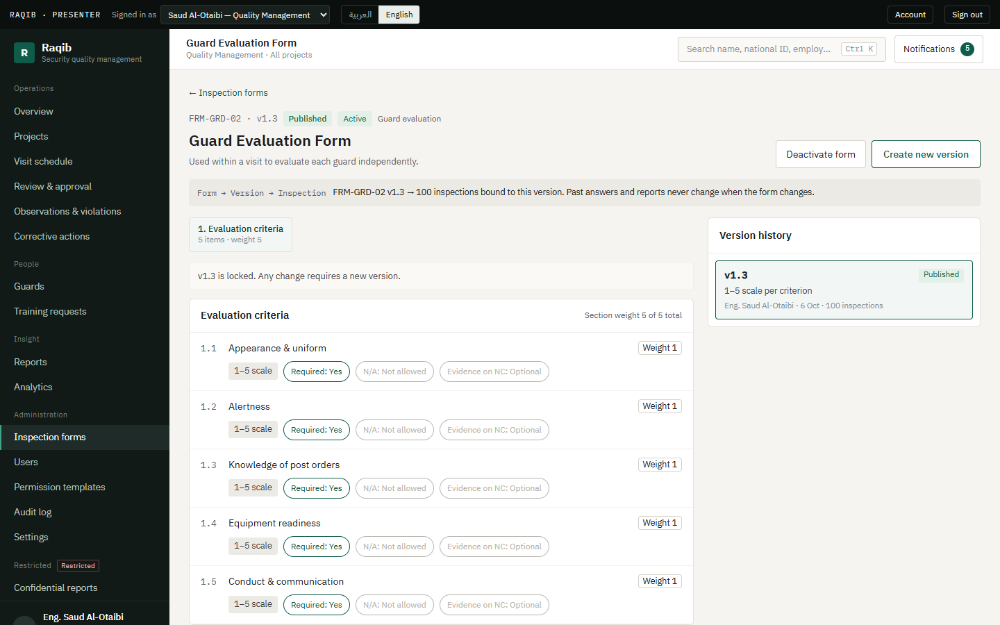 |
| **Permission templates:** what each role may do, per module 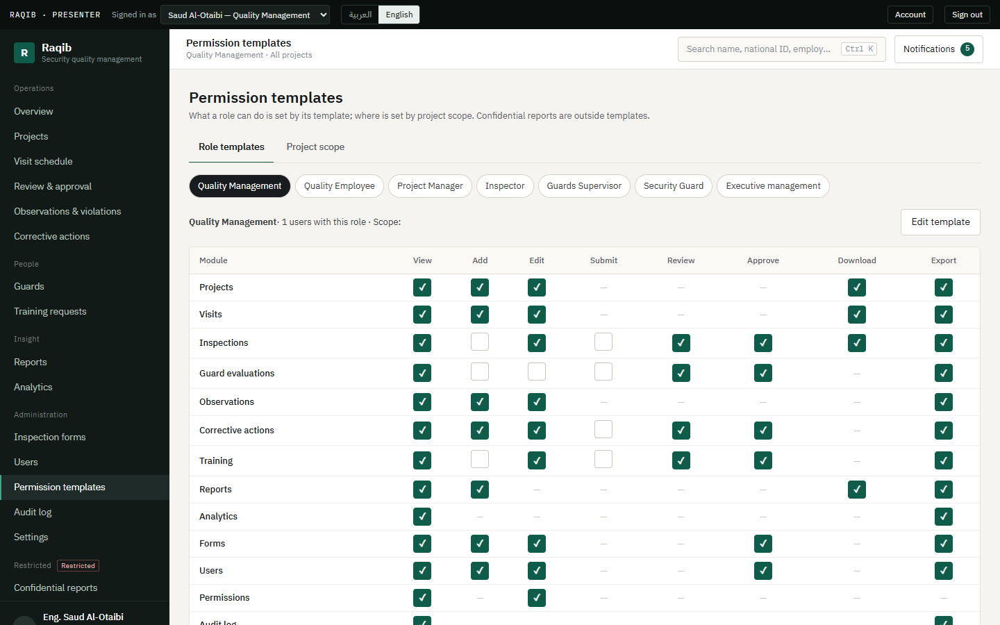 | **Arabic and right-to-left:** the same screens, mirrored 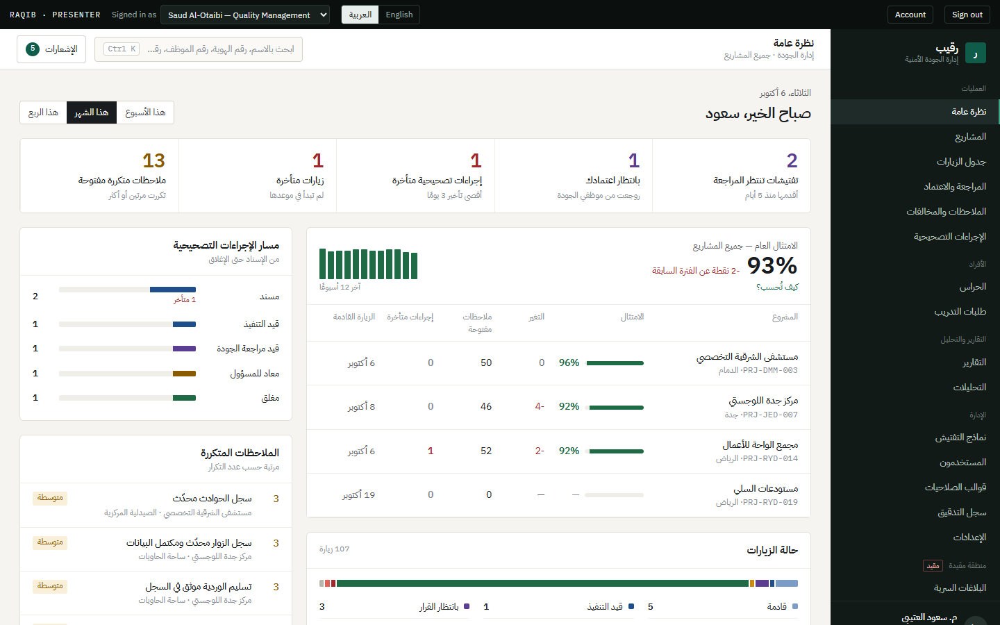 |

All data shown is synthetic demo data.

## Who uses it

| Role | What they do |
|---|---|
| **Quality Management** (director) | Everything: schedules visits, approves inspections, closes actions, manages forms, people and permission templates, reads the audit log |
| **Quality Employee** | Reviews submitted inspections, flags items, returns or forwards them, reviews corrective-action closures |
| **Project Manager** | Sees their projects, owns and works corrective actions, approves training requests (supervisors' and, after the supervisor's review, guards') for their projects |
| **Quality Inspector** | Runs assigned inspections (one or several forms per visit) in the field, offline if needed, with notes, photos, video and guard scores. Never sees a score |
| **Security Supervisor** | Evaluates and develops guards, raises training requests, reviews the requests their guards make for themselves |
| **Administrative Staff** | Keeps the visit schedule and prints or exports it for the projects they are assigned; nothing else by default |
| **Security Guard** | Sees their own record and training requests, can ask for training for themselves, answers surveys and can file a confidential report |
| **General Manager** | Executive view of compliance and audit; issues the time-limited grants that open the confidential area; names who manages scoring rules and who manages surveys |

## Lifecycles

Every lifecycle is a state machine enforced on the server, with an append-only history that records who, what,
when and why:

| Record | States |
|---|---|
| Visit | Scheduled → Assigned → In progress → Pending review → Pending approval → Approved · Returned (back to the inspector) · Rejected · Cancelled. *Overdue* is derived from dates, never stored. |
| Corrective action | Assigned → In progress → Quality review → Closed. Returned actions go back to work. Open actions can be reassigned or re-dated with a reason. |
| Training request | A guard's own request starts **At the supervisor**, then **Pending** (project manager) → Approved → Scheduled → Completed · Returned · Rejected. A supervisor's request starts at Pending. The supervisor-review step can be switched off in Settings. |
| Account request | Pending → Approved (a password-setup link is sent) · Rejected |
| Confidential report | New → Under review → Closed |
| Survey | Draft → Open → Closed (answers go to the confidential area, never back through the survey) |

## Highlights

- **The server is the only authority.** Every route sits behind a fail-closed guard, and a static test fails
  the build if any route lacks a declared permission. Permissions are per-organization templates of 14 modules
  by 8 rights, scoped to dated project assignments, with object rules on top: nobody reviews, approves or
  closes their own work, and review and approval are separate rights.
- **History can't be rewritten, even by us.** Published form versions, the item snapshot of an inspection,
  issued reports and every workflow history are immutable through database triggers. An inspection always
  shows the form version it was run on, whatever happens to the form later.
- **Offline-first field work.** A service worker and an IndexedDB outbox keep inspectors working with no
  signal: answers and photos queue per user, reload offline without being signed out, and replay in order on
  reconnect. A browser test cuts the network, answers, reloads, reconnects and checks everything arrived.
- **A real confidential area.** Separate tables, a separate rule, and no role opens it. Access needs a
  General-Manager-issued, expiring, revocable grant plus a logged entry with a stated reason. The reporter's
  identity is stored apart (or not at all for anonymous reports) and opens only through a logged reveal.
- **Defence in depth on personal data.** National IDs and second-factor secrets are sealed with AES-256-GCM
  and looked up through a keyed blind index. Sign-in has lockout, TOTP two-step verification with recovery
  codes, forced rotation and session revocation. Account requests erase their personal details after a
  retention period, and an administrator can export everything held about one person.
- **Uploads are inspected, not trusted.** Content must match the declared type, PDFs with scripts are refused,
  photos are re-stored without GPS and device metadata, and ClamAV can scan every file. Files go straight to
  **Cloudflare R2** over presigned URLs, and a nightly job removes uploads nobody attached.
- **Reports that print properly.** Approval freezes an immutable report snapshot. PDFs are made in the browser: the
  server returns the report as one print-ready page (evidence photos embedded, Arabic and English) and the browser prints it to PDF, so no
  Chromium or rendering service is needed anywhere. Analytics and the audit log export as CSV and as native
  Excel workbooks written by Raqib's own small xlsx writer, with spreadsheet-formula injection neutralised.
- **Operable from day one.** Prometheus-style metrics and alert hooks, a health endpoint, scheduled jobs that
  elect a single leader with a Postgres advisory lock, retention and lifecycle jobs, and a provisioning script
  that stands up a new customer's organization.
- **Real demo history.** The demo company is seeded by playing a year of inspections through the real
  workflows, about ninety approved inspections with findings that improve over time, so the dashboard has real
  data behind every number.

### Client feedback round 1 (October 2026)

The first client review added, in place and without rebuilding anything: **deduction scoring** (100 minus the client's approved deductions,
versioned and restricted to a person the General Manager names, with the earlier weighted score kept until the values are entered);
**several forms in one visit**, each with its own issue number and score; **escalation** of unresolved corrective actions at 3, 6 and 9
days by in-app notice and email, plus an immediate alert for high-severity observations; **configurable shifts** with rest and
consecutive-day rules; an **audited corrections log** for system-generated data; the **Administrative Staff** role; **A4 print kit** for
completed reports, blank forms and the visit schedule; month view, export and print on the schedule; and closure-time, recurring-violation,
training and ranking analytics. The client's own values (deductions, shift hours, escalation rule, original forms) are configuration, not
code: see [raqib/docs/RAQIB_REQUIREMENTS_MATRIX.md](../../raqib/docs/RAQIB_REQUIREMENTS_MATRIX.md) for what is verified and what is still
waiting on the client.

### Client requirements 15–20 (October 2026)

The second brief added, again in place: **project ranking** by observations, improvement, complaints and contract-expiry proximity
(with contract dates and employees assigned on each project, an order selector, and editable weights; complaint figures show only to
people holding a confidential grant); **search** by national ID and inspection issue number as well as name, employee number, case
number and project code, always within the caller's permissions; **training approval chains** for supervisors' and guards' requests;
**confidential surveys** for guards, managed by people the General Manager names and answered through the confidential channel;
**branding** (name and logo) on every printed document; the **quality department's responsibility model** (quality verifies, the project
manager remediates) tested; and the delivery, cost and acceptance documents. The report page shows every form of a visit with its
deductions, the schedule dialog can name the guards on shift, a visit is started on its scheduled day unless the organization allows
early starts, and a violation's note and evidence cannot stay behind when an item is changed back to compliant.

For the client: [requirement checklist (Arabic)](../../raqib/docs/RAQIB_CLIENT_CHECKLIST_AR.md) ·
[(English)](../../raqib/docs/RAQIB_CLIENT_CHECKLIST_EN.md) · [what we still need from them](../../raqib/docs/RAQIB_MATERIALS_REQUEST.md) ·
[costs, stages and handover](../../raqib/docs/RAQIB_DELIVERY.md).

### By the numbers

| | |
|---|---|
| HTTP routes, each behind a declared permission or explicitly public | **141** |
| Tenant tables with forced row-level security | **41** `raqib_*` tables, 27 migrations of hand-written SQL |
| Roles · permission modules · rights | **8 · 14 · 8** |
| Backend tests (unit, integration over real HTTP, authorization, RLS) | **373** in 48 files |
| Browser tests (real Chrome, real backend, offline, sign-in, MFA, downloads, a full inspection-to-closure workflow) | **57** (plus 8 read-only checks for a live deployment) |
| Web unit tests, including architecture rules and a check that every string key exists | **58** |
| Interface strings, each in Arabic and English | **1,977** |
| Screens from the approved design | **38**, plus the account and survey screens, with full right-to-left layout |

## How it's built

```
raqib/
├── backend/        NestJS on Core, its own `raqib` database, port 3300
│   └── app/raqib/  access · projects · visits · forms · inspections · scoring · corrections · review
│                   observations · actions · training · evidence · reports · analytics · search · audit
│                   confidential · surveys · onboarding · settings · account · lifecycle · jobs
│                   observability · provisioning · demo
├── web/            React 19 + Vite + Tailwind 4, port 4500, installable and offline-capable
│   └── src/        services → api → presenters → hooks → components → features → app
└── docs/           architecture.md · security.md · operations.md · the client requirement documents
```

The web app is layered, and the layers are enforced by a test: low layers (config, services, the API client)
never import UI, nothing reaches the network except the API layer, every color comes from one `colors.ts` and
every font stack from one file. Each backend module has the same shape as the other products
(`domain / application / infrastructure / api / validation / tests`).

## Run it locally

```bash
cd raqib/backend
cp .env.example .env            # RAQIB_SEED_DEMO=true seeds the demo company
createdb raqib
npm run migrate && npm run dev  # migrates, seeds, serves :3300 (docs: /api/docs)
cd ../web && npm install && npm run dev        # http://localhost:4500
```

The first boot plays the demo history through the real workflows, which takes about a minute. To use Cloudflare R2 instead of local disk,
see the file-storage section of [raqib/docs/operations.md](../../raqib/docs/operations.md).

The client's own values (deduction table, shift hours, rest rules) are not known yet. To show the whole workflow anyway, start the server with
`RAQIB_DEMO_SAMPLE_VALUES=true`: it seeds clearly labelled **placeholder** values (high 10 / medium 5 / low 2 deductions, three 8-hour shifts, a
6-day limit). Put it on the command line rather than in `.env`, because the test suite reads `.env` too. An already seeded demo can be brought
up to date without a reset by `npm run demo:upgrade` (it only adds what is missing and checks consistency).

## Demo accounts

The password is `demo-password-2026` for every account.

| Login | Role |
|---|---|
| `s.alotaibi@raqib.sa` | Quality Management |
| `n.alqahtani@raqib.sa` | Quality Employee |
| `f.aldosari@raqib.sa` | Project Manager |
| `k.alshehri@raqib.sa` · `r.alzahrani@raqib.sa` | Inspector |
| `m.alharbi@raqib.sa` | Security Supervisor |
| `h.alzahrani@raqib.sa` | Administrative Staff |
| `g-10302@raqib.sa` | Security Guard |
| `m.alsudairi@raqib.sa` | General Manager |

## Tests

| Suite | Command | What it covers |
|---|---|---|
| Backend | `cd raqib/backend && npm run ci` | typecheck · lint · format · 373 tests (real HTTP, authorization, tenant isolation, security, retention, scoring, surveys, training chains) · build |
| Web | `cd raqib/web && npm run typecheck && npm run lint && npm run format:check && npm test && npm run build` | 58 tests including the architecture rules and the string-key check, then the production build |
| End to end | `cd raqib/web && npm run e2e` | Playwright in real Chrome against the real backend on a throw-away database: every role opens every screen, offline field work, sign-in lockout, two-step verification, setup and upkeep flows, CSV, Excel and PDF downloads, surveys, training approval chains |
| Live site | `E2E_WEB=… E2E_API=… npx playwright test e2e/90-live-smoke.spec.ts` | Read-only: signs in as each role on a running deployment and checks the screens and key figures. The rest of the e2e suite creates data and must never be pointed at a showcase server |

## Known limitations

- **The PDF is the browser's print dialog.** "PDF" opens it with the report loaded; choose "Save as PDF". The file name is pre-filled, but the server never produces a file.
- **The rate limiter is in-process memory**, so a multi-process deployment needs a shared store. The scheduled
  jobs are already safe to run in several processes.
- **Video evidence streams through the API**, not a time-limited storage URL.
- **Roles are global per deployment**, because Core roles are not per-tenant yet.
- **No outgoing e-mail on the live server.** Escalation and set-up e-mails go as far as Core's outbox; real delivery needs an SMTP server configured (`AURIC_SMTP_URL`).
- **Client-owned content is still pending.** The original inspection forms, the approved deduction table, shift hours, the escalation counting rule, MOI/quality standards and the organization's name and logo are configuration the client supplies. Until then the demo uses placeholders ([what we still need](../../raqib/docs/RAQIB_MATERIALS_REQUEST.md)).
- **Screenshots predate the October client rounds.** They show the product before deduction scoring, multi-form visits, surveys and the ranking indicators.

## More

[raqib/README.md](../../raqib/README.md) · [raqib/web/README.md](../../raqib/web/README.md) · [raqib/docs/architecture.md](../../raqib/docs/architecture.md) ·
[docs/raqib-deployment.md](../raqib-deployment.md) · [raqib/docs/security.md](../../raqib/docs/security.md) · [raqib/docs/operations.md](../../raqib/docs/operations.md)
