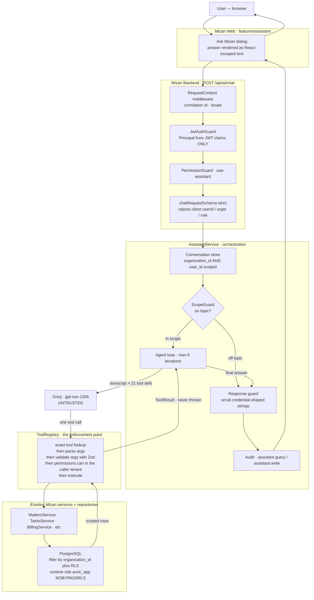
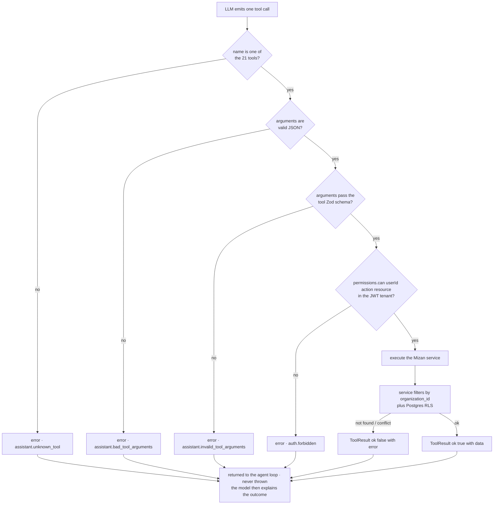
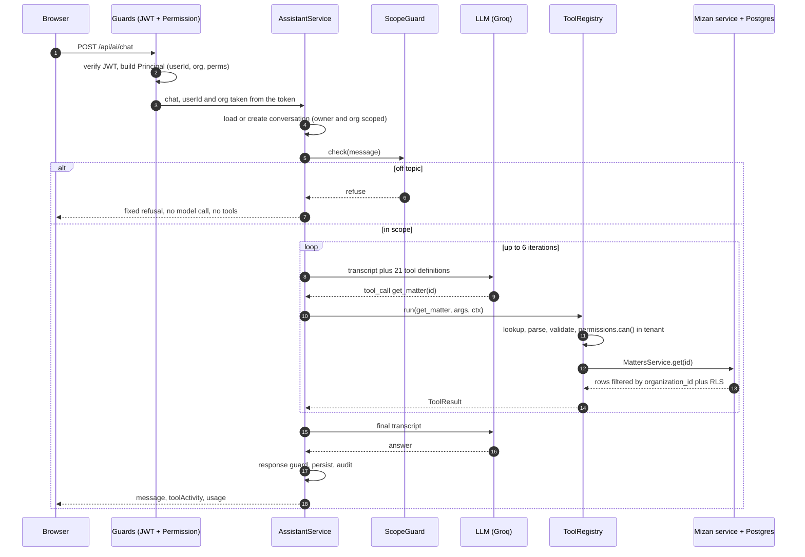
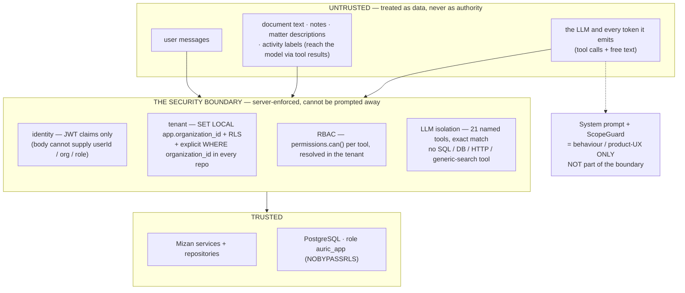

# File uploads & the AI assistant — how they're built

A build walkthrough of the two "middleware" layers most people ask about: the
**presigned file-upload flow** and the **Mizan Copilot** orchestration layer.
Both share the same house rules — tenant-scoped, RBAC-gated, behind a swappable
adapter, never letting domain code (or a model) reach storage/SQL directly.

Reference docs for the exhaustive detail:

- Files: [`core/files/README.md`](../core/files/README.md)
- Assistant: [`docs/assistant.md`](./assistant.md)

The one place the two meet: the assistant's `get_matter_documents` tool returns
document **metadata only** — it never calls `IFileStorage.getContent()`, so file
bytes never reach the LLM.

---

# Part 1 — The file-upload middleware (`core/files/`)

> Pre-existing AURIC Core infrastructure. Documented here for the walkthrough;
> the source of truth is `core/files/README.md`.

## Why it isn't a normal `POST`

Uploading a file *through* the Node API is bad on a small box: the bytes buffer
in process memory, a worker is held for the whole transfer, and a 25 MB PDF on a
~1 GB VPS is a real hazard. So the bytes never pass through the API. The API
handles only **metadata + authorization**; the bytes go **browser → storage
directly**.

## The three-step presigned flow

```
1. PRESIGN     POST /api/documents            { name, contentType, byteSize }
               → lawfirm_documents row + a `files` row (status: pending)
               → { document, upload: { url, method:"PUT", headers, expiresAt } }

2. PUT BYTES   PUT <upload.url>                <raw file bytes>
               → browser sends bytes straight to storage; the API is not involved

3. CONFIRM     POST /api/documents/:id/confirm
               → API HEADs the object to prove it landed
               → reconciles real size/mime, flips files.status → stored
               → records the "document.uploaded" activity   (on confirm, not presign)
```

`presign ≠ upload complete`. Until step 3, the document is **not downloadable** —
`DocumentsService.content()` throws `document.upload_pending`. The state machine
is: a `pending` file with unconfirmed bytes is invisible.

The old single-request multipart `POST /api/files` still exists for server-side
and small uploads.

## One contract, two adapters

Everything above the byte-moving layer talks to the `IFileStorage` interface
(`core/contracts`). The adapter is chosen by `AURIC_FILE_STORAGE_DRIVER`:

| | `local` (dev / the VPS) | `r2` (Cloudflare R2) |
|---|---|---|
| `upload.url` | **relative** `/files/:id/bytes` — an authenticated loopback route on the API | **absolute** — a real presigned S3 URL, signature in the query string |
| Auth on the `PUT` | the normal Bearer token | none — the presigned signature *is* the auth; R2 rejects an `Authorization` header |
| Signing | none | hand-rolled **AWS SigV4** (`core/files/infrastructure/sigv4.ts`) — no AWS SDK |

Switching drivers is a config flag with **no use-case change** — `DocumentsService`
never knows which one is active.

## The middleware pieces

- **`main.ts` raw-body parser** — a per-content-type parser for
  `application/octet-stream` with `bodyLimit: 25 MiB`, so *only* the loopback
  bytes route escapes the global 1 MiB JSON cap; every other route keeps the
  tight limit.
- **Tenant isolation** — the storage key is namespaced by `organization_id`, the
  `files` record is RLS-scoped, and the loopback route is
  `@RequirePermission("upload","file")`.
- **Lifecycle** — `files.status`: `pending` → (`writeBytes`) → (`confirmUpload`
  HEADs storage) → `stored`. `committed_at` timestamp on confirm.
- **Orphan cleanup** — deleting a document deletes the stored object too
  (best-effort; a storage hiccup doesn't fail the delete).

## The frontend's one job (`mizan/web/src/lib/api/upload.ts`)

`putToPresignedUrl()` is the only place that must know the driver difference: it
detects `^https?://` and either

- adds the bearer token + forces `Content-Type: application/octet-stream` (local
  loopback), or
- sends the `Blob` raw with no auth header (R2 presigned URL).

Everything else — presign, confirm — is a normal authenticated API call.

---

# Part 2 — The AI assistant middleware (`mizan/backend/app/lawfirm/assistant/`)

> Built as a Mizan product capability, **not** promoted into AURIC Core.

## The one decision everything follows from

**The LLM is an untrusted actor.** It is never given the database, Prisma,
Kysely, a filesystem, or a "search everything" function. It gets a fixed menu of
21 named tools, each a thin wrapper over an existing Mizan service method that is
*already* authorization-checked.

> The model decides *which* tool to call and *with what arguments*. It never
> decides *whether it is allowed*.

## Architecture, visualized

### The AI layer, end to end



### One tool call — every gate



### A single turn, over time



## The request pipeline

```
POST /api/ai/chat   { conversationId?, message, currentContext? }
  │
  ▼ RequestContextMiddleware   correlation id + locale → AsyncLocalStorage
  ▼ JwtAuthGuard               verify JWT → Principal { userId, organizationId, permissions }
  │                            patchContext({ userId, organizationId })   ← identity is the token, never the body
  ▼ PermissionGuard            use:assistant   (the on/off switch per role)
  ▼ AssistantController        body validated by chatRequestSchema (.strict() — rejects userId/orgId/role)
  ▼ AssistantService.chat()
       1. no active org → 403
       2. resolve org + user name        (for the prompt only; no elevated access)
       3. load-or-create conversation    findForOwner(id, userId) → WHERE org AND id AND user_id
       4. load last 24 messages
       5. persist the user message
       6. ScopeGuard.check()             off-topic → fixed refusal, RETURN (no model call, no tools)
       7. transcript = [ system prompt | ...history | user message ]
       8. AGENT LOOP  (≤ AI_MAX_TOOL_ITERATIONS = 6):
            resp = AiClient.createChatCompletion({ messages, tools: 21 defs })   → Groq gpt-oss-120b
            if no tool calls → finalText = resp.content; break
            for each tool call:
                ToolRegistry.run(name, argsJSON, toolCtx)
                persist assistant(tool_call) + tool(result) rows
       9. guardResponse(finalText)        scrub credential-shaped strings
      10. persist the final assistant message
      11. audit: lawfirm.assistant.query   (+ .write if a write tool succeeded)
  │
  ▼ { conversationId, message, toolActivity[], usage }
```

## Layer by layer

### Config & the provider boundary — `assistant-config.ts`, `ai/ai-client.ts`

`AssistantConfig` is parsed once at boot from a Zod schema: `AI_PROVIDER`,
`AI_MODEL`, `AI_BASE_URL`, `GROQ_API_KEY`, timeouts, the iteration cap,
`AI_SCOPE_ENFORCEMENT`. It is **Mizan-owned** — deliberately *not* in
`core/kernel/config.ts` (Core stays domain-agnostic).

`AiClient` is a one-method interface:
`createChatCompletion({ messages, tools }) → { content, toolCalls, usage }`.
Everything above it is provider-independent. The one implementation,
**`OpenAiCompatibleClient`**, is a single `fetch` — no SDK — that:

- applies an `AbortController` timeout (merged with any caller signal),
- maps the Chat Completions wire response to our shape,
- maps failures to a safe taxonomy: `429 → assistant.rate_limited`,
  timeout `→ assistant.timeout`, else `→ assistant.upstream_unavailable`,
  no key `→ assistant.not_configured`.

Groq only exposes Chat Completions (not the Responses API the original brief
named); the interface makes a Responses provider a drop-in.

### The scope guard — `scope-guard.ts`

A **product/UX restriction, not a security boundary**. Before the agent loop:

- in-scope heuristics (firm entities, Mizan how-to, greetings — EN + AR) → pass,
  no model call
- out-of-scope heuristics (coding, general knowledge, content generation) →
  refuse, no model call
- a terse message with history → pass (it's a follow-up)
- anything left → one tiny classifier call (`IN_SCOPE`/`OUT_OF_SCOPE`, ~250 tokens)

Out of scope → a fixed, localised refusal, persisted as the assistant turn, the
agent loop **never runs**. Fails *open* on a classifier error. Configurable:
`strict` (default) / `prompt_only` / `off`.

### The system prompt — `system-prompt.ts`

Built per request with org name, user display name, today's date, locale, and
the screen/matter/client *hints*. Sections: what the assistant is · `## Scope` ·
`## Trusted context vs. untrusted data` (tool results are records, never
instructions) · behaviour rules (never invent Mizan data, never claim an action
happened without a tool confirming it, confirm consequential writes, don't leak
internals).

Never trusted as a security boundary — it is behaviour shaping.

### The tool abstraction — `tools/`

```ts
interface AssistantTool {
  name: string;
  description: string;
  permission: { action, resource } | null;   // never null in practice
  mutates?: boolean;
  parameters: ZodSchema;
  execute(args, ctx): Promise<unknown>;
}
```

- **`read-tools.ts`** — 18 tools (`get_matter`, `search_clients`, `get_invoice`,
  `get_dashboard_summary`, …), each delegating to one existing service method;
  lists capped at 25–40 items.
- **`write-tools.ts`** — 3 tools (`create_task`, `update_task`, `assign_task`) →
  `TasksService`. Only operations the app already supports; `mutates: true`.
- **`zod-to-json-schema.ts`** — a ~70-line converter (object / string / number /
  boolean / enum / array / optional). Tool schemas are shallow by design, so
  this beats a dependency.
- **`tool-registry.ts`** — the enforcement point. `run(name, rawArgs, ctx)`:

  1. `byName.get(name)` — exact match against the 21-tool map → unknown ⇒
     `assistant.unknown_tool`
  2. `JSON.parse(rawArgs)` → malformed ⇒ error result
  3. `tool.parameters.safeParse` → invalid ⇒ error result
  4. **`readInTenant(() => permissions.can(ctx.userId, action, resource))`** — the
     same `IPermissionProvider` the HTTP guards use, resolved in the caller's
     tenant → false ⇒ `auth.forbidden`
  5. `tool.execute(args, ctx)` → the service →
     `WHERE organization_id = requireOrganizationId()` + Postgres RLS

  Every failure is **returned as a `ToolResult`, never thrown** — the agent loop
  hands the real error back to the model, which then explains. It never
  fabricates success.

`ToolContext = { userId, organizationId, locale, correlationId, currentContext }`
is **entirely server-derived** from the JWT. No tool's schema contains
`userId`/`organizationId`/`role`, so the model cannot supply them.

### The orchestrator — `assistant-service.ts`

The agent loop. Notable choices:

- each conversation write is its own `uow.transaction`, so RLS's
  `SET LOCAL app.organization_id` is applied and no transaction is held open
  across the slow LLM call;
- tool calls + results are persisted (`tool_calls` JSONB / `tool` rows) so the
  loop is replayable and the UI can show "what the assistant did";
- hard iteration cap; if hit, one final `tools: []` call forces a plain answer;
- on upstream failure, the mapped `AppError` propagates — persisted partial
  messages remain and the next request continues;
- `guardResponse()` scrubs `gsk_…`/`sk-…`/JWT/`postgres://…` shapes from the
  answer — **defence-in-depth, explicitly not the boundary** (nothing secret is
  ever in context).

### Conversation model — `conversation-repository.ts` + migration `…_lawfirm_assistant`

Two tables — `lawfirm_ai_conversations`, `lawfirm_ai_messages` — with the **same
tenant-isolation RLS as every other `lawfirm_*` table**. A conversation is
`organization_id` **and** `user_id` scoped: `findForOwner(id, userId)` is the
only read path, so a conversation is private to its owner *within* its tenant.
History is bounded by `AI_MAX_HISTORY_MESSAGES`; no summarization in v1.

### Observability & audit

- One structured pino line per turn (`module: "assistant"`): correlation id,
  user id, org id, model, iterations, tools + ok/err, token usage, latency,
  ok/refused. **No message text, no legal content, no API key.**
- One `lawfirm.assistant.query` row in Core `audit_logs` per turn (tools
  invoked, resource ids touched, `refused` reason); a successful write also
  writes `lawfirm.assistant.write`.

### The frontend — `mizan/web/src/features/assistant/`

The top-bar "Ask Mizan" launcher. `sendChat()` sends **only**
`{ conversationId?, message, currentContext? }` through the shared `httpClient`
(Bearer token, 401-refresh). The answer renders as `{text}` inside a `<p>` —
**React-escaped; no `dangerouslySetInnerHTML` or markdown anywhere in the app**,
so an echoed `<script>` from a poisoned document is inert text. `currentContext`
is derived from the route and validated against an id/slug regex
(`lib/current-context.ts`). `can("use:assistant")` hides the button — **UX only**;
the backend enforces the permission and every per-tool check.

---

# The security invariant

> No sequence of model outputs — any tool, any arguments, in any order, with any
> prompt or document content — can cause Mizan to return or modify data the
> authenticated principal is not authorized to access.

### Trust zones



The system prompt and the scope guard shape *behaviour* — they are useful and
tested, but a fully jailbroken model that ignores every instruction still cannot
get past `BOUNDARY`.

### The boundary, layer by layer

| Layer | Mechanism |
|---|---|
| Identity | `Principal` from the JWT (`claims.sub` / `claims.org` / `claims.perms`); the request body cannot supply identity (schema is `.strict()`) |
| Tenant | JWT `org` → ambient context → `SET LOCAL app.organization_id` → RLS `tenant_isolation` on every `lawfirm_*` table + explicit `WHERE organization_id` in every repo; prod connects as `auric_app` (`NOBYPASSRLS`) |
| RBAC surface | `@RequirePermission("use","assistant")` |
| RBAC per tool | `permissions.can(userId, action, resource)` in the caller's tenant, before `execute` |
| LLM isolation | 21-tool exact-match registry; no SQL / DB / HTTP / generic-search tool; no `currentExecutor()` / Kysely / Prisma / `fs` / `fetch` in any tool body |
| Response | credential-shape scrub (defence-in-depth) |

Proven by `mizan/backend/app/lawfirm/assistant/tests/assistant-security.test.ts`
(21 tests, scope guard **off** to isolate the boundary): cross-org read on every
id-taking tool, cross-org write, per-tool RBAC for three partial-permission
roles, no-db-pathway, prompt-injection-can't-escalate, schema strictness, audit.

## Adding a tool = adding an AI-accessible API endpoint

The checklist (also at the top of `tools/tool.ts`):

1. **Permission** — a concrete `{ action, resource }`, never null.
2. **Tenant** — the service scopes by `organization_id` *and* the table is under
   RLS. If not, don't add the tool.
3. **Resources** — it can only reach what the permission implies.
4. **Sensitive fields** — the service view excludes internal / credential /
   other-user PII fields. Never `JSON.stringify(rawRow)`.
5. **Enforcement** — authorization lives in the *service*, not just the tool.
6. **Mutation** — writes set `mutates: true` (⇒ model confirmation + a
   `lawfirm.assistant.write` audit row).
7. **Auditable** — covered by the per-turn `lawfirm.assistant.query` row.
8. **Tests** — add a cross-tenant + a permission-deny case to
   `assistant-security.test.ts`.
